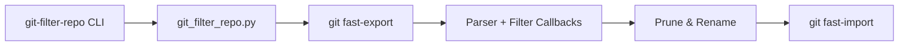

# newren/git-filter-repo

> Outil de réécriture d'historique Git, rapide et sûr, qui remplace filter-branch et BFG.

## Le problème
`git filter-branch` est très lent et piégeux, et BFG ne couvre que quelques types de réécriture.

## Ce que ça fait vraiment
Script Python unique qui lit `git fast-export`, applique des filtres (garder ou retirer des chemins, renommer, changer les tags, réécrire les messages) puis alimente `git fast-import`. Supprime les commits devenus vides, refuse de tourner hors d'un clone neuf sauf `--force`, repacke ensuite. Sert aussi de bibliothèque.

## Comment c'est branché


## Essayer
```bash
git filter-repo --path src/ --to-subdirectory-filter my-module --tag-rename '':'my-module-'
```

## Coût et pièges
Gratuit ; git >= 2.36.0 et Python >= 3.6. Réécrit l'historique : à faire sur un clone neuf. Licence non identifiée par GitHub.

## Ce que ce n'est pas
Pas un outil de sauvegarde : l'ancien historique est supprimé. Il n'a pas d'interface graphique.

## Alternatives
git filter-branch et BFG Repo Cleaner, présentés comme plus lents ou plus limités ; filter-lamely et bfg-ish en dérivent.

## Pour toi
À adopter : indispensable pour purger un gros fichier ou un secret d'un dépôt de données ou de modèles.

