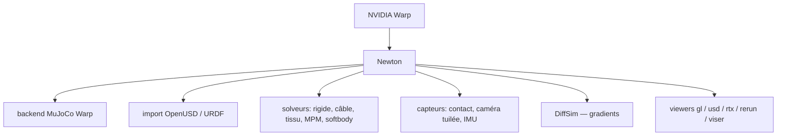

# newton-physics/newton

> Moteur de simulation physique différentiable sur GPU, destiné aux roboticiens et chercheurs.

## Le problème
Simuler un robot demande un moteur rapide, différentiable et capable d'importer des descriptions standard.
Les moteurs existants sont soit CPU, soit fermés, soit non dérivables.

## Ce que ça fait vraiment
Construit sur NVIDIA Warp, il généralise le module `warp.sim` (déprécié) et intègre MuJoCo Warp comme backend principal.
Il met l'accent sur le calcul GPU, le support OpenUSD, la différentiabilité et l'extensibilité par l'utilisateur.
La bibliothèque d'exemples couvre le rigide (pendule, URDF, joints), les robots (G1, H1, ANYmal, UR10, Panda, Allegro), les contrôleurs (impédance articulaire, IK différentielle), les câbles, le tissu, la MPM granulaire, les capteurs et la DiffSim.
Cinq viewers sont sélectionnables au lancement — `gl`, `usd`, `rtx`, `rerun`, `viser` — plus `null` pour le calcul pur.

## Comment c'est branché


## Essayer
```bash
pip install "newton[examples]"
python -m newton.examples
python -m newton.examples --list
python -m newton.examples basic_urdf --device cuda:0
python -m newton.examples basic_viewer --viewer usd --output-path my_output.usd
```

## Coût et pièges
Gratuit, Apache-2.0 pour le code et CC-BY-4.0 pour la documentation, licences tierces dans `newton/licenses`.
Il faut un GPU NVIDIA Maxwell ou plus récent avec pilote 545+ (CUDA 12) ; aucun CUDA Toolkit local n'est requis, mais macOS tourne en CPU seulement.

## Ce que ce n'est pas
Ce n'est pas un simulateur clé en main avec éditeur : c'est une bibliothèque Python pilotée en ligne de commande.
Ce n'est pas non plus stable au sens API figée — la politique de versionnement et de dépréciation est renvoyée au guide de compatibilité.

## Alternatives
- MuJoCo Warp : le backend lui-même, si tu n'as pas besoin de la couche Newton.
- `warp.sim` : le module d'origine, déprécié et remplacé par ce dépôt.

## Pour toi
Gouvernance Linux Foundation et différentiabilité GPU en font la référence à suivre si tu touches à la robotique simulée.
