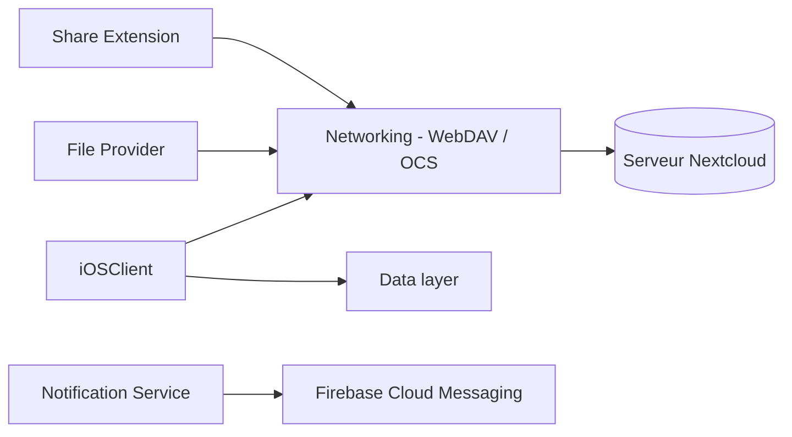

# nextcloud/ios

> Application iOS officielle de Nextcloud pour parcourir, synchroniser et partager ses fichiers.

## Le problème
Accéder à son serveur Nextcloud depuis un iPhone ou un iPad demande un client natif avec envoi et partage de fichiers.

## Ce que ça fait vraiment
Le README traite surtout de la contribution : forum, traductions, DCO (signature `Signed-off-by`), fichier `GoogleService-Info.plist` requis pour compiler (Firebase), TestFlight, tests unitaires, d'intégration (serveur Nextcloud de test via `Tests/Server.sh`) et d'interface. D'après le code : application principale (WebDAV, chiffrement de bout en bout, base locale) et extensions : fournisseur de fichiers, partage, notifications push, widgets.

## Comment c'est branché

## Essayer
Aucune commande d'installation dans le README (l'application se télécharge sur l'App Store). Seul un usage de contribution est documenté : ajouter un `Signed-off-by` (`git commit -s`), et lancer `Tests/Server.sh` avant les tests d'intégration.

## Coût et pièges
Exige un serveur Nextcloud et Xcode 26.1 pour compiler. Push via Firebase. `Tests/Server.sh` peut supprimer un conteneur portant le même nom : lire le script avant.

## Ce que ce n'est pas
Ce n'est pas un serveur Nextcloud, seulement le client iOS. Il est sous GPL-3.0.

## Alternatives
Aucune alternative nommée dans le README ; NextcloudKit est cité pour les tests d'API.

## Pour toi
À ignorer : client mobile sans lien avec la data ou le MLOps.

