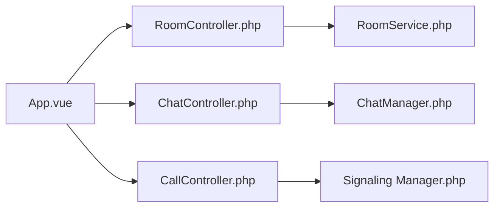

# nextcloud/spreed

> Application de visioconférence et de messagerie intégrée à Nextcloud, pour équipes auto-hébergées.

## Le problème
Les outils de visio et de chat sont des services tiers séparés de ses fichiers et de son agenda.

## Ce que ça fait vraiment
Application Nextcloud (PHP + Vue) : discussions privées, de groupe ou publiques avec mot de passe, appels audio/vidéo, partage d'écran, sondages, fils de messages, chat fédéré entre serveurs et synchronisation avec d'autres messageries via Matterbridge. S'intègre à Fichiers, Calendrier, Contacts, Deck. Un serveur TURN peut être nécessaire derrière des pare-feux stricts.

## Comment c'est branché


## Essayer
```bash
make dev-setup
make build-js
# puis activer l'application dans la gestion des applications de Nextcloud
```

## Coût et pièges
Gratuit, mais il faut une instance Nextcloud ; un serveur TURN est parfois nécessaire. 884 issues ouvertes.

## Ce que ce n'est pas
Pas un service autonome : il tourne dans Nextcloud. Une branche par version de Nextcloud.

## Alternatives
Aucune alternative nommée dans le README.

## Pour toi
À surveiller : pertinent si ton équipe a déjà Nextcloud et veut une visio souveraine, sans intérêt isolé.

