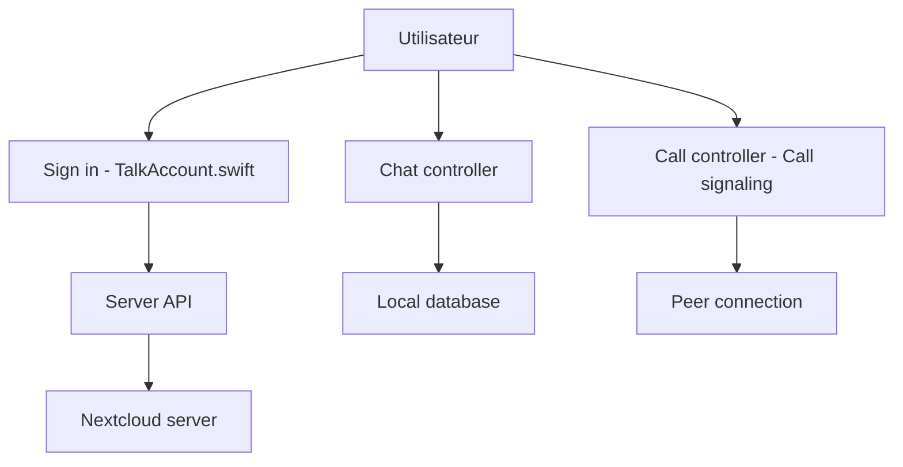

# nextcloud/talk-ios

> Client iOS officiel de Nextcloud Talk : chat et appels audio/vidéo vers ton serveur Nextcloud.

## Le problème
Utiliser Nextcloud Talk sur iPhone sans passer par un service de messagerie hébergé chez un tiers.

## Ce que ça fait vraiment
Application iOS native : connexion à un serveur Nextcloud, liste de conversations, messages et envois de fichiers, appels via signalisation et connexion pair-à-pair WebRTC. Elle inclut des extensions de partage et d'upload d'écran, et les notifications push. Le projet embarque ses propres builds WebRTC (version 150.7871.0).

## Comment c'est branché


## Essayer
```bash
pod install
open NextcloudTalk.xcworkspace
./start-instance-for-tests.sh
xcodebuild test -workspace NextcloudTalk.xcworkspace -scheme "NextcloudTalk" -destination "platform=iOS Simulator,name=iPhone 16,OS=18.5" -test-iterations 3 -retry-tests-on-failure
```

## Coût et pièges
Gratuit, mais il faut un serveur Nextcloud 22+ avec Talk 12+ et CocoaPods. Pour compiler soi-même, changer les bundle ids `com.nextcloud.Talk` et les app groups, puis `NCAppBranding.m`. Les tests exigent une instance Nextcloud sous Docker.

## Ce que ce n'est pas
Pas un serveur : il faut déjà un Nextcloud. Pas une bibliothèque réutilisable. Licence GPL-3.0 avec exception App Store.

## Alternatives
Aucune alternative nommée dans le README.

## Pour toi
À ignorer pour la veille data/IA : c'est un client mobile de messagerie, utile seulement si ton équipe utilise Nextcloud et développe sur iOS.

