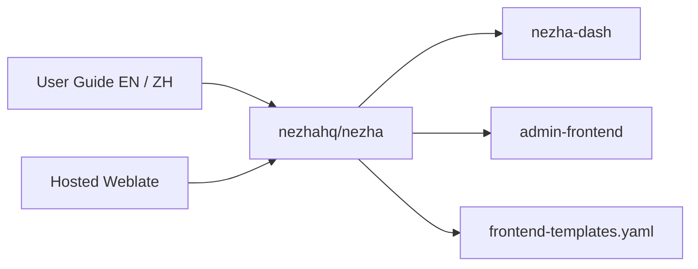

# nezhahq/nezha

> Outil de supervision de serveurs à thèmes interchangeables, documenté en chinois et anglais.

## Le problème
Non documenté dans ce README : le texte fourni ne décrit ni le besoin ni le fonctionnement.

## Ce que ça fait vraiment
Le README disponible se limite à des liens : guide utilisateur (anglais et chinois), canaux Telegram,
traductions hébergées sur Weblate, captures d'écran d'un front utilisateur (`hamster1963/nezha-dash`)
et d'une console d'administration (`nezhahq/admin-frontend`). Les thèmes se déclarent en ajoutant une
entrée dans `service/singleton/frontend-templates.yaml`. Rien d'autre n'est décrit.

## Comment c'est branché

## Essayer
Aucune commande documentée dans ce README.

## Coût et pièges
Non documenté : ni prérequis, ni installation, ni dépendances ne figurent dans le texte fourni.

## Ce que ce n'est pas
Impossible de le dire depuis ce README : il ne contient ni description fonctionnelle, ni limites,
ni licence. Matière insuffisante pour trancher — tout jugement supposerait d'aller lire la documentation
externe, hors de portée de cette fiche.

## Alternatives
Aucun dépôt alternatif n'est nommé dans le README.

## Pour toi
À écarter en l'état : rien dans le README ne permet d'évaluer l'outil.
