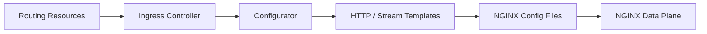

# nginx/kubernetes-ingress

> Contrôleur Ingress pour NGINX et NGINX Plus, qui configure un répartiteur de charge selon les ressources Kubernetes.

## Le problème
Exposer des applications d'un cluster Kubernetes à des clients externes avec routage et TLS.

## Ce que ça fait vraiment
Surveille les ressources Ingress, VirtualServer/VirtualServerRoute et TransportServer, les valide, les traduit en configuration NGINX et l'applique. Gère routage par hôte et chemin, terminaison TLS, TCP/UDP. Contrôleurs annexes pour cert-manager et ExternalDNS ; App Protect, télémétrie et métriques Prometheus en option.

## Comment c'est branché

## Essayer
Le README ne donne pas de commande : il renvoie au chart Helm ou aux manifestes, et à l'exemple Cafe.

## Coût et pièges
Version stable indiquée : 5.6.3. NGINX Plus demande un abonnement F5 et une image à construire ou à récupérer. Faire correspondre versions d'image, chart et documentation.

## Ce que ce n'est pas
Pas un service mesh ni une passerelle d'API complète. Ne pas confondre avec l'ingress-nginx de la communauté Kubernetes.

## Alternatives
Le README ne nomme aucune alternative.

## Pour toi
À ignorer pour la veille data/IA : brique d'infrastructure réseau, à voir seulement si tu gères l'exposition d'un cluster.
