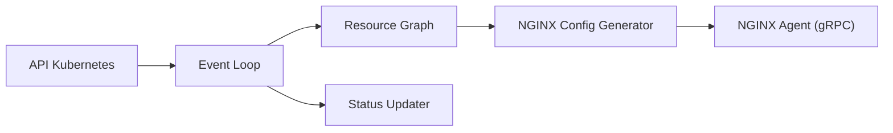

# nginx/nginx-gateway-fabric

> Implémentation Gateway API de Kubernetes qui pilote NGINX comme plan de données.

## Le problème
Configurer un load balancer ou une passerelle API sur Kubernetes avec les ressources standards Gateway API plutôt que des annotations.

## Ce que ça fait vraiment
Un contrôleur qui lit `Gateway`, `GatewayClass`, `HTTPRoute`, `GRPCRoute`, `TCPRoute`, `TLSRoute`, `UDPRoute`, valide, construit un graphe de ressources, génère la config NGINX et la déploie via NGINX Agent. Branches annexes : politiques, polling de bundles WAF, statut, télémétrie, métriques Prometheus. SBOM publiés.

## Comment c'est branché

## Essayer
Aucune commande d'installation dans ce README (pas de bloc copiable). Étapes citées : démarrer un cluster kind, installer NGF, déployer les exemples ; tout est dans la documentation NGINX.

## Coût et pièges
Cluster Kubernetes 1.32+ requis (édition actuelle). Version NGINX Plus et WAF F5 possibles mais commerciales. Version 0.Y.Z instable, mais la dernière release est 2.7.2.

## Ce que ce n'est pas
Pas un contrôleur Ingress classique ni un service de mesh. Pas de passerelle pour LLM en particulier.

## Alternatives
Le README ne cite aucune alternative.

## Pour toi
À surveiller : brique d'infra Kubernetes sérieuse pour exposer tes services de serving, sans lien direct avec la data science.
