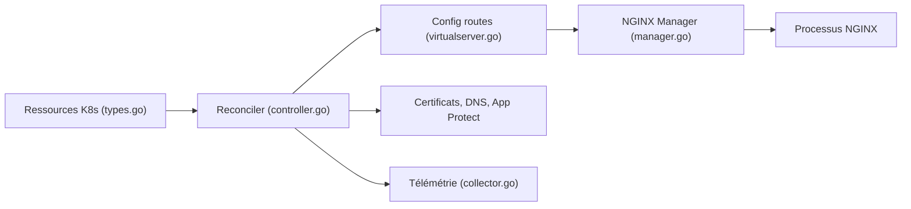

# nginxinc/kubernetes-ingress

> Contrôleur Ingress pour NGINX et NGINX Plus qui configure le load balancer depuis des ressources Kubernetes.

## Le problème
Exposer des applications d'un cluster vers l'extérieur demande un équilibreur HTTP configuré selon les ressources Ingress.

## Ce que ça fait vraiment
Le contrôleur tourne dans un pod avec NGINX, surveille les ressources Ingress, VirtualServer/VirtualServerRoute et TransportServer, génère la configuration NGINX et l'applique via un gestionnaire (avec retour arrière). Routage par hôte et chemin, terminaison TLS. Branches : gestion de certificats, ExternalDNS, App Protect (WAF, DoS), health checks, métriques, télémétrie. Des SBOM sont publiés.

## Comment c'est branché


## Essayer
```bash
# Le README renvoie à la doc : installation par chart Helm ou manifestes.
docker buildx imagetools inspect nginx/nginx-ingress:edge --format '{{ json (index .SBOM "linux/amd64").SPDX }}' | grype
```

## Coût et pièges
NGINX gratuit ; images NGINX Plus via registre F5 (licence Plus). Versions image, manifestes et doc doivent correspondre (stable 5.6.3 citée). La version « edge » sert aux tests.

## Ce que ce n'est pas
Pas le contrôleur Ingress du projet Kubernetes « ingress-nginx » : c'est l'implémentation de l'équipe NGINX/F5. Le README ne détaille pas le contenu de la télémétrie.

## Alternatives
Non documenté dans le README : aucune alternative nommée.

## Pour toi
À surveiller si ton cluster d'inférence ou tes API d'IA sont déjà derrière NGINX ; sinon l'Ingress livré par ta plateforme suffit.

