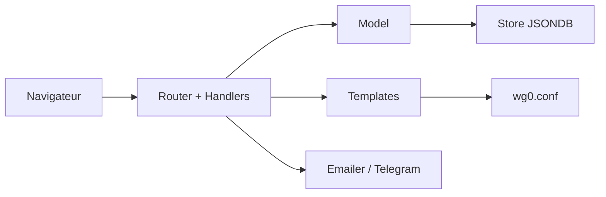

# ngoduykhanh/wireguard-ui

> Interface web pour gérer une installation WireGuard : clients, configuration, distribution par QR code.

## Le problème
Gérer à la main les fichiers WireGuard, leurs clés et les envois aux clients devient fastidieux.

## Ce que ça fait vraiment
Serveur Go avec authentification, gestion des clients (nom, e-mail…), paramètres globaux, génération du fichier `wg0.conf` par modèle, envoi de la configuration par QR code, fichier, e-mail (SMTP, SendGrid) ou Telegram. Il génère la configuration seulement : un service systemd, openrc ou l'option Docker redémarre WireGuard.

## Comment c'est branché


## Essayer
```bash
./wireguard-ui
docker-compose up
docker build --build-arg=GIT_COMMIT=$(git rev-parse --short HEAD) -t wireguard-ui .
```

## Coût et pièges
Gratuit. Identifiants par défaut admin/admin : à changer, et définir `SESSION_SECRET`. Le redémarrage de WireGuard n'est pas automatique sans systemd ou `WGUI_MANAGE_RESTART`. Dernier push en août 2024.

## Ce que ce n'est pas
Pas un client WireGuard ni un outil réseau complet : il édite la configuration du serveur.

## Alternatives
Aucune alternative nommée dans le README.

## Pour toi
À surveiller : commode pour distribuer des accès VPN à une petite équipe, mais peu actif et à durcir avant exposition.

