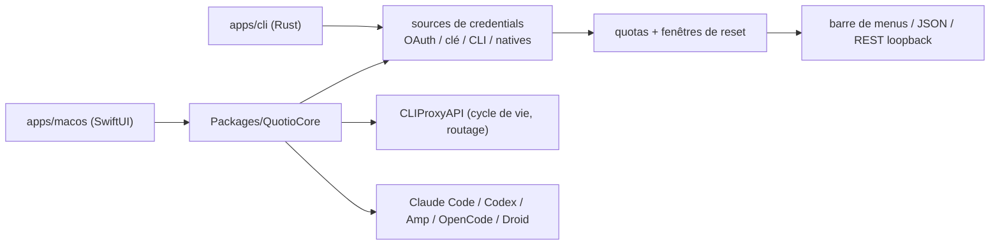

# nguyenphutrong/quotio

> Tableau de bord macOS et CLI pour suivre les quotas, comptes et agents de code locaux.

## Le problème
Savoir ce qui reste de quota chez trois fournisseurs d'IA impose d'ouvrir trois tableaux de bord, et
reconfigurer chaque agent de code se fait en éditant des fichiers de configuration à la main.

## Ce que ça fait vraiment
Affiche les limites de comptes et les fenêtres de réinitialisation depuis la barre de menus, l'appli,
le terminal, une sortie JSON ou une API REST locale. Rassemble les comptes via les sources de
credentials supportées (OAuth, clé d'API, CLI, natives) sans recopier de secrets dans les fichiers de
projet. Démarre et surveille CLIProxyAPI, gère le routage. Détecte et configure Claude Code, Codex
CLI, Amp, OpenCode et Factory Droid en préservant les réglages existants. Deux produits dans le même
dépôt : l'appli SwiftUI (macOS 14+) et un CLI Rust (macOS Apple Silicon/Intel et Linux x64), dont les
paquets npm et Homebrew embarquent les binaires natifs — pas de toolchain Rust requise.

## Comment c'est branché


## Essayer
```bash
brew install --cask nguyenphutrong/tap/quotio
brew install nguyenphutrong/tap/quotio
npm install --global quotio
quotio providers
quotio usage
quotio usage --provider mock --format json
swift test --package-path Packages/QuotioCore
cargo test --manifest-path apps/cli/Cargo.toml --locked --all-features
```

## Coût et pièges
Gratuit. Il faut des comptes chez les fournisseurs suivis, et l'outil manipule leurs credentials — le
README insiste sur le fait que rien ne passe par un service Quotio hébergé, ce qui est justement le
point à vérifier soi-même. L'appli complète est réservée à macOS 14 ou plus.

## Ce que ce n'est pas
Pas un proxy : CLIProxyAPI est un composant tiers que Quotio pilote, pas ce qu'il implémente. Pas
multiplateforme pour la partie visuelle : hors macOS, il ne reste que le CLI. Les listes de
fournisseurs et de quotas exacts ne sont pas dans le README, seulement dans la doc du dépôt.

## Alternatives
Aucune alternative nommée dans le README.

## Pour toi
Utile au quotidien si tu jongles entre plusieurs agents de code ; à tester avant d'y mettre tes clés.
