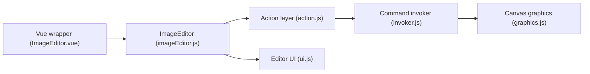

# nhn/tui.image-editor

> Éditeur d'images HTML5 Canvas en JavaScript, avec enveloppes Vue et React.

## Le problème
Intégrer dans une page web recadrage, dessin et filtres d'images sans écrire un éditeur.

## Ce que ça fait vraiment
Charge une image dans un canvas (fabric.js 4.2.0) : recadrage, retournement, rotation, redimensionnement, dessin libre, formes, icônes, texte, masques, filtres (sépia, flou, pixelisation, etc.), annuler/rétablir, téléchargement. Thèmes clair et sombre personnalisables. Paquets JS, Vue et React.

## Comment c'est branché


## Essayer
Pas de commande d'installation dans le README (liens vers les paquets `toast-ui.image-editor`, Vue et React). Contribution :
```bash
npm install
```

## Coût et pièges
Gratuit. Dépôt archivé, dernier push novembre 2023 ; dépendances anciennes (fabric.js 4.2.0).

## Ce que ce n'est pas
Pas maintenu : aucune correction attendue.

## Alternatives
Aucune nommée dans le README.

## Pour toi
À ignorer : archivé et sans lien avec data/IA.

