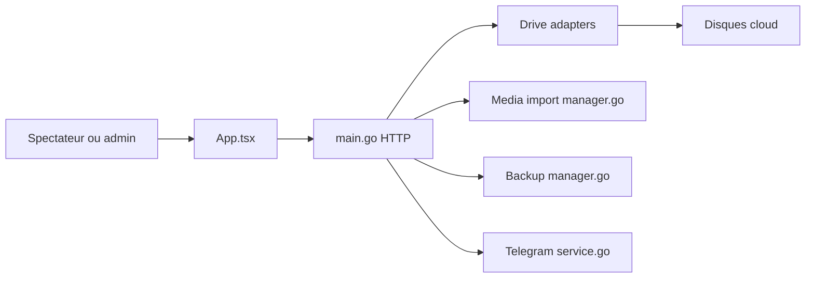

# nianzhibai/91

> Site vidéo personnel auto-hébergé en Go, branché sur des disques cloud, pour usage privé.

## Le problème
Regarder ses vidéos stockées sur plusieurs disques cloud sans les rapatrier ni payer la bande passante du serveur.

## Ce que ça fait vraiment
Serveur Go + interface web qui indexe des vidéos de disques cloud (115, PikPak, 123, OneDrive, Google Drive, WebDAV…). Mode 302 pour lire sans consommer la bande passante du serveur, mode « shorts » vertical, partage à usage unique, import par scripts de crawlers, sauvegardes et intégration Telegram. Les détails de plusieurs sous-systèmes backend n'ont pas été vus dans le code.

## Comment c'est branché


## Essayer
```bash
mkdir video-site-91 && cd video-site-91
curl -fsSL https://raw.githubusercontent.com/nianzhibai/91/main/docker-compose.yml -o docker-compose.yml
docker compose up -d
docker exec -it video-site-91 ./server reset-password
```

## Coût et pièges
Gratuit, mais dépend de comptes de disques cloud tiers. La base stocke aussi les identifiants des disques : à protéger. README entièrement en chinois.

## Ce que ce n'est pas
Pas un outil data/IA. Le README précise un usage strictement privé et le respect des lois. Pas de support iOS recommandé pour le mode shorts.

## Alternatives
Aucune alternative citée ; le README remercie OpenList (interfaces de disques) et ArtPlayer (lecteur).

## Pour toi
À ignorer : un site vidéo personnel sans lien avec data, IA ou MLOps, et au contenu cloud/crawlers que tu n'as aucune raison d'héberger.

