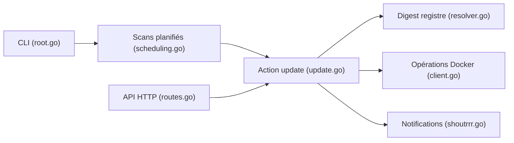

# nicholas-fedor/watchtower

> Conteneur qui met à jour automatiquement les images Docker en cours d'exécution ; pour homelabs et dev local.

## Le problème
Garder des conteneurs à jour demande de tirer l'image, arrêter l'ancien conteneur et le relancer avec les mêmes options.

## Ce que ça fait vraiment
Il découvre les conteneurs surveillés, compare les digests du registre (ou des révisions Git), puis remplace les conteneurs périmés en conservant leur configuration. Scans planifiés ou uniques en CLI ; API HTTP (mise à jour, vérification, santé, métriques, historique) ; notifications via Shoutrrr, hooks de cycle de vie, ordre par dépendances, filtres, authentification de registre.

## Comment c'est branché


## Essayer
```bash
docker run --detach \
    --name watchtower \
    --volume /var/run/docker.sock:/var/run/docker.sock \
    nickfedor/watchtower
```

## Coût et pièges
Gratuit ; accès au socket Docker. Testé avec Docker API 1.43+. L'auteur ne recommande pas son usage en environnement commercial ou de production.

## Ce que ce n'est pas
Pas un outil de déploiement contrôlé : une mise à jour automatique d'image peut casser un service. Le README est court, la doc complète est externe.

## Alternatives
Kubernetes avec CI/CD (par exemple Talos Linux avec FluxCD, cité par le README) pour la production.

## Pour toi
Pratique sur un serveur perso hébergeant tes outils ML ; pour des services de production ou des modèles versionnés, une mise à jour implicite est un risque, préfère un pipeline explicite.

