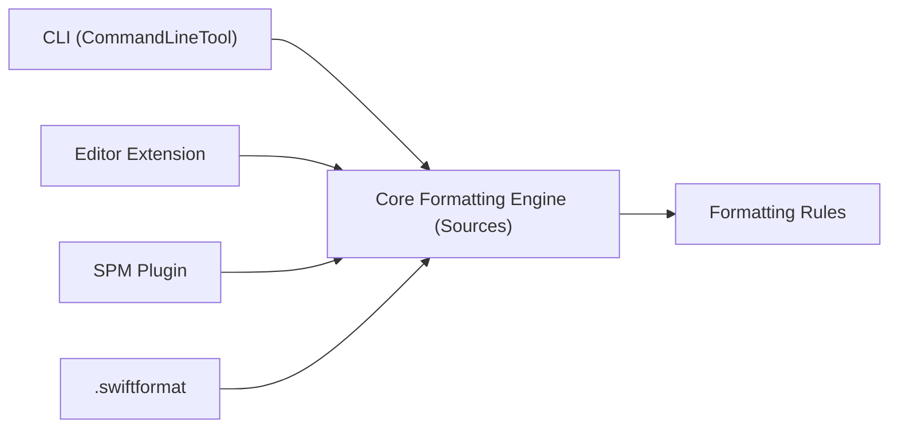

# nicklockwood/SwiftFormat

> Bibliothèque et outil en ligne de commande qui reformatent le code Swift selon des règles de style configurables.

## Le problème
Les équipes se disputent le style de code et le faire respecter à la main est fastidieux et source d'erreurs.

## Ce que ça fait vraiment
Reformate le code Swift au-delà des espaces : ajout ou retrait de `self`, parenthèses redondantes, plus de 50 règles activables ou non. Configuration par `.swiftformat` ou options. Mode `--lint` pour la CI, extension Xcode, plugin SwiftPM, hook pre-commit, image Docker, formatage des blocs Swift dans les fichiers Markdown.

## Comment c'est branché


## Essayer
```bash
brew install swiftformat
swiftformat --infer-options "/path/to/your/code/"
swiftformat .
swiftformat --lint .
```

## Coût et pièges
Gratuit. `swiftformat .` écrase les fichiers : valider d'abord dans git. Certaines règles peuvent casser la compilation (liste de problèmes connus dans le README).

## Ce que ce n'est pas
Ce n'est pas un linter de qualité : SwiftLint détecte, SwiftFormat corrige.

## Alternatives
SwiftLint, cité dans la FAQ comme outil complémentaire.

## Pour toi
À ignorer sauf si tu écris du Swift : réservé au développement Apple, sans usage dans un flux data, IA ou MLOps.

