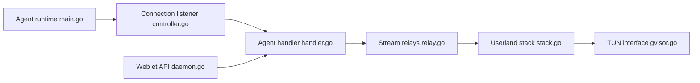

# nicocha30/ligolo-ng

> Outil de tunnel réseau par interface TUN, pour testeurs d'intrusion autorisés qui relient des réseaux.

## Le problème
Atteindre un réseau distant via un SOCKS ou des redirecteurs TCP/UDP impose proxychains et ralentit les outils. Ligolo-ng remplace cela par une interface réseau virtuelle.

## Ce que ça fait vraiment
Un agent établit une connexion inverse TCP/TLS vers un proxy. Le proxy crée une interface TUN ; une pile réseau en espace utilisateur (gVisor) traduit les paquets en connexions réelles côté agent. L'agent n'a pas besoin de droits administrateur, le proxy si (création de la TUN). Version 0.8 : API, interface web multi-opérateurs, fichier de configuration, mode démon, routes automatiques (Windows, Linux, macOS, BSD). Débit annoncé : plus de 100 Mbit/s.

## Comment c'est branché


## Essayer
```bash
# Aucune commande dans le README : renvoie vers la documentation en ligne
# (Setup/Quickstart) de Ligolo-ng.
```

## Coût et pièges
Gratuit. Le proxy doit pouvoir créer une interface TUN (droits élevés). Sans privilèges côté agent, pas de paquets bruts : un scan SYN devient un connect() TCP, d'où des faux positifs (le README conseille `--unprivileged` ou `-PE` avec nmap).

## Ce que ce n'est pas
Pas un VPN d'entreprise ni un produit de sécurité défensif : c'est un outil de test d'intrusion. À n'utiliser que sur des systèmes dont on détient l'autorisation écrite d'accès. Le mTLS figure encore dans la liste des tâches à faire.

## Alternatives
- Chisel : tunnel TCP/UDP, mentionné par le README, mais sans interface TUN.
- Ligolo (version d'origine) : même auteur, ancêtre cité dans la comparaison.
- Meterpreter : cité aussi ; plateforme plus large, mécanisme de tunnel différent.

## Pour toi
Surveiller : utile seulement si tu fais des tests d'intrusion autorisés ou du red teaming ; sans ce besoin, aucun usage data/IA/MLOps direct.

