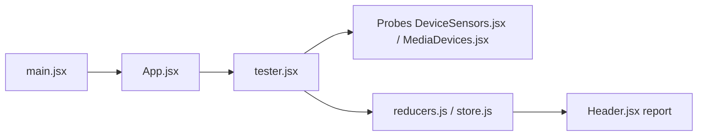

# niespodd/browser-fingerprinting

> Guide de veille sur les protections anti-bot et le fingerprinting, avec un petit testeur d'empreinte navigateur.

## Le problème
Un scraper légitime se heurte à des protections anti-bot dont les mécanismes (empreintes, TLS, comportement) sont mal documentés.

## Ce que ça fait vraiment
- Le README est surtout un guide : cas d'usage, fournisseurs de proxies et de scraping, liste des éditeurs anti-bot, navigateurs furtifs, pages de test d'empreinte.
- Il consigne des observations sur des plugins d'évasion (puppeteer-extra-plugin-stealth) et des projets alternatifs (nodriver, patchright, camoufox).
- Il contient aussi un avis tranché : selon l'auteur, les anti-bots ne font que renchérir le scraping.
- Le code est un testeur React/Redux : des sondes (capteurs, médias, extensions…) produisent un rapport hachable et partageable.

## Comment c'est branché

## Essayer
Aucune commande documentée dans le README : le contenu est de la documentation à lire.

## Coût et pièges
Gratuit, mais le guide oriente vers des services payants (proxies, scraping, résolution de captchas) ; il avertit lui-même que certains navigateurs furtifs peuvent contenir des malwares. Aucune licence déclarée.

## Ce que ce n'est pas
Ce n'est pas un outil prêt à l'emploi. Contourner des protections anti-bot peut enfreindre les conditions d'un site ou la loi : vérifier l'autorisation et les CGU avant tout scraping.

## Alternatives
Pour contourner la détection : nodriver, rebrowser-patches, patchright, camoufox (cités dans le README) ; pour tester son empreinte : EFF Cover Your Tracks, browserleaks.

## Pour toi
Ignorer : surtout un guide d'évasion anti-bot sans licence ; utile seulement comme veille si tu dois comprendre la détection de bots.

