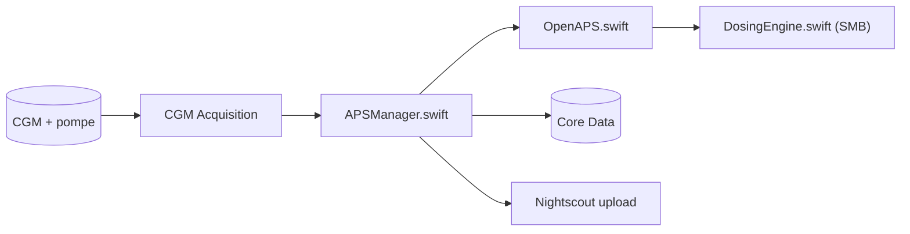

# nightscout/Trio

> Système ouvert d'administration automatisée d'insuline pour iOS, fondé sur l'algorithme OpenAPS.

## Le problème
Des personnes diabétiques veulent un système configurable qui ajuste l'insuline à partir du capteur de glucose et de la pompe.

## Ce que ça fait vraiment
D'après le code : acquisition du glucose (Bluetooth, plugins), stockage des glucides et des événements dans Core Data, calcul OpenAPS (autosensibilité, prévisions, détermination du basal, règle SMB), interface SwiftUI, application Watch, Live Activity et synchronisation Nightscout. Le lien exact entre coordinateur de boucle et pompe n'est pas vérifiable dans l'échantillon.

## Comment c'est branché


## Essayer
```bash
git clone --branch=<branch> --recurse-submodules https://github.com/nightscout/Trio.git && cd Trio
echo 'DEVELOPER_TEAM = xxxxxxxxxx' > ConfigOverride.xcconfig
xed .
```

## Coût et pièges
Il faut un identifiant de développeur Apple et Xcode (ou un build via GitHub/TestFlight). Le README avertit : usage à ses risques, non approuvé CE ou FDA.

## Ce que ce n'est pas
Ce n'est pas un dispositif médical approuvé. Un dosage d'insuline automatisé n'est pas un terrain d'expérimentation pour un profil data.

## Alternatives
Le README cite Loop (LoopKit), FreeAPS X et iAPS comme origines du projet.

## Pour toi
À ignorer : logiciel de dosage d'insuline non certifié, hors de ton périmètre ; sa lecture n'a de sens que comme étude d'algorithme.

