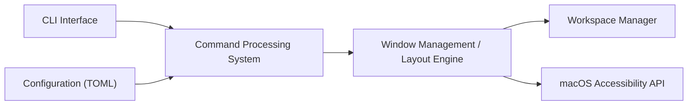

# nikitabobko/AeroSpace

> Gestionnaire de fenêtres en mosaïque pour macOS, inspiré d'i3, pour utilisateurs avancés.

## Le problème
macOS n'offre pas de disposition en mosaïque au clavier, et ses Spaces natifs sont limités.

## Ce que ça fait vraiment
Organise les fenêtres en arbre (paradigme i3), émule ses propres espaces de travail au lieu des Spaces macOS, gère plusieurs écrans, se configure par un fichier TOML et se pilote en ligne de commande. Il n'exige pas de désactiver SIP. Le projet est en bêta publique avec des changements incompatibles attendus avant la version 1.0. Il n'est pas notarisé.

## Comment c'est branché


## Essayer
```bash
brew install --cask nikitabobko/tap/aerospace
```

## Coût et pièges
Gratuit. macOS 13+ seulement. Non notarisé : le script Homebrew supprime l'attribut de quarantaine. Instabilités connues (fenêtres qui sautent d'espace).

## Ce que ce n'est pas
Ce n'est pas compatible avec les Spaces natifs de macOS. L'auteur exclut l'interface graphique de configuration et l'esthétique.

## Alternatives
- yabai : gestionnaire de fenêtres macOS à partitionnement binaire.
- Amethyst : gestionnaire à la xmonad.

## Pour toi
Ignorer : confort personnel de poste macOS, bêta, sans lien avec les besoins data/IA/MLOps.

