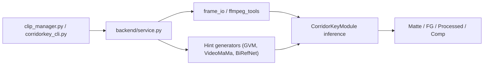

# nikopueringer/CorridorKey

> Modèle de détourage d'écran vert qui restitue couleur du premier plan et alpha linéaire, pour artistes VFX.

## Le problème
Sur un fond vert, les bords (cheveux, flou de bougé) mélangent sujet et fond ; les incrusteurs classiques et le rotoscoping IA donnent des masques durs et perdent la semi-transparence.

## Ce que ça fait vraiment
À partir d'une image brute et d'un masque grossier (« AlphaHint »), le réseau prédit pour chaque pixel la couleur droite du premier plan et un alpha linéaire. Le masque peut venir de GVM, VideoMaMa ou BiRefNet, intégrés en option. Sorties EXR (`Matte`, `FG`, `Processed`) et aperçu PNG. Écran vert ou bleu détecté automatiquement ; backends Torch (CUDA, ROCm, MPS, CPU) et MLX.

## Comment c'est branché


## Essayer
```bash
uv sync
uv sync --extra cuda
docker build -t corridorkey:latest .
docker compose --profile gpu run --rm corridorkey run_inference --device cuda
uv run python clip_manager.py --action run_inference --device cpu
```

## Coût et pièges
Conçu sur une carte de 96 Go de VRAM ; 6 à 8 Go annoncés pour la version récente, environ 18 Go sur AMD à 2048×2048. GVM demande environ 80 Go de VRAM. Licence proche d'un CC BY-NC-SA : réutilisation commerciale du logiciel autorisée, mais pas de revente, pas d'API d'inférence payante, et les variantes gardent le nom et la licence.

## Ce que ce n'est pas
Ce n'est pas un outil clé en main sans masque d'entrée : la qualité dépend du masque fourni. Pas d'entraînement ni de jeux de données publiés à ce jour.

## Alternatives
Le README cite GVM, VideoMaMa et BiRefNet, mais comme générateurs de masques intégrés plutôt que comme concurrents.

## Pour toi
Surveiller : modèle de matting intéressant à tester sur GPU, mais licence particulière, sortie EXR orientée VFX et projet jeune tenu par une personne.

