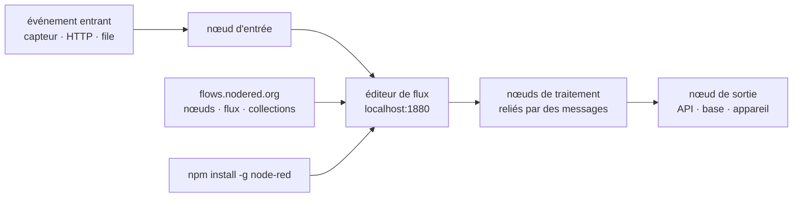

# node-red/node-red

> **Browser-based flow editor for wiring event-driven applications without writing the glue.**

## The problem

Connecting an event source to a transformation and then to a destination — a sensor, a queue,
an API, a database — means writing the same plumbing every time: connect, decode, transform,
re-emit, handle failure. That code is short but never reused, and each new integration starts
again in yet another repository. The README does not describe this problem: it states it in
one line, "low-code programming for event-driven applications".

## What it actually does

Node-RED is a flow-based programming environment: you drop nodes onto a canvas in the browser
and wire them together, each wire carrying messages from one node to the next. The README
shows a screenshot of that editor and says nothing else about the internals.

What the repository itself ships, per the README, is the runtime and the editor, distributed
as a global npm package that serves an editor at `http://localhost:1880`. What it does *not*
ship is more telling: the catalogue of nodes and flows lives outside the repository, on the
`flows.nodered.org` library, split into the three families the README's badges count — nodes
(third-party integrations), shared flows, collections.

The README documents neither the flow storage format, nor an API, nor production deployment,
nor authentication: it points to `nodered.org/docs` for all of it. The readable material here
is limited to installation, building from source, and governance.

## How it is wired



No code-derived diagram exists for this repository: the graph above is reconstructed from the
README alone, which names no source file. The only verifiable anchors are port `1880` and the
fact that the node library is an external service feeding the editor.

## Trying it

```bash
sudo npm install -g --unsafe-perm node-red
node-red
```

Then open <http://localhost:1880>. For the development code, the README gives:

```bash
git clone https://github.com/node-red/node-red.git
cd node-red
npm ci
npm run build
npm start
```

## Cost and traps

- **Free, Apache-2.0 licensed**, an OpenJS Foundation project: no API key, no account to
  create, no bill.
- **Node.js required**: the README states no minimum version; it has to be looked up in the
  external documentation. That is the first thing to settle before installing.
- **`sudo npm install -g --unsafe-perm`**: the recommended install is global, as root, with
  install scripts enabled. On a shared machine or a server that is a decision, not a detail.
- **The server starts with no documented authentication**: the README runs `node-red` and sends
  you to `localhost:1880` without a word about securing it. Exposing that port means offering
  an editor that executes code.
- **The real cost is elsewhere**: in the third-party nodes installed from the library, whose
  quality and maintenance are not this repository's concern.

## What it is not

- **Not a hosted service.** You install and run it yourself; the README mentions no managed
  offering.
- **Not a catalogue of integrations.** Nodes and flows live on `flows.nodered.org`, outside the
  repository: installing Node-RED does not give you the connectors, you add them.
- **Not a batch processing orchestrator or a job scheduler**: the announced model is an event
  traversing a graph, not a job that runs and reports a status. The README says nothing about
  retries, persistence or recovery.
- **Not "no-code"**: the README says *low-code*. Transformation nodes still expect logic to be
  written.

## Alternatives

The batch lists no neighbours for this repository (the column is empty), and the README names
no competing project — only ecosystem resources (forum, Slack, flow library). No comparable
alternative in the catalogue can therefore be cited without inventing one, which this note
refuses to do.

## For you

Useful as an acquisition and wiring layer upstream of a data chain: plugging in heterogeneous
event sources and normalising them towards a queue or a database, without writing one service
per source. Foundation governance, Apache-2.0, over twenty thousand stars: project risk is low.
Not to be confused with a pipeline scheduler or a training platform — and never to be exposed
without first reading the external documentation on securing it, which the README omits.
