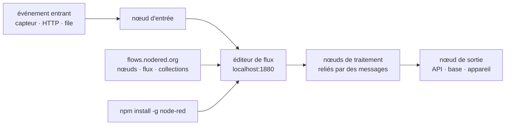

# node-red/node-red

> **Éditeur de flux dans le navigateur pour câbler des applications pilotées par événements, sans écrire le liant.**

## Le problème

Relier une source d'événements à un traitement puis à une destination — un capteur, une file,
une API, une base — demande à chaque fois le même code de plomberie : connexion, décodage,
transformation, réémission, reprise sur erreur. Ce code est court mais jamais réutilisé, et
chaque intégration nouvelle repart de zéro dans un dépôt de plus. Le README ne décrit pas ce
problème : il l'annonce d'une ligne, « low-code programming for event-driven applications ».

## Ce que ça fait vraiment

Node-RED est un environnement de programmation par flux : on pose des nœuds sur un canevas
dans le navigateur et on les relie, chaque lien portant des messages d'un nœud au suivant.
Le README montre une capture de cet éditeur et rien d'autre du fonctionnement interne.

Ce que le dépôt fournit lui-même, d'après le README, est le moteur d'exécution et l'éditeur,
distribués comme un paquet npm global qui ouvre un serveur sur `http://localhost:1880`.
Ce qu'il n'embarque pas est plus parlant : le catalogue de nœuds et de flux vit en dehors du
dépôt, sur la bibliothèque `flows.nodered.org`, répartie en trois familles annoncées par les
badges du README — nœuds (intégrations tierces), flux partagés, collections.

Le README ne documente ni le format de stockage des flux, ni l'API, ni le déploiement en
production, ni l'authentification : il renvoie pour tout cela vers `nodered.org/docs`. La
matière lisible ici se limite donc à l'installation, à la construction depuis les sources et
à la gouvernance.

## Comment c'est branché



Aucun diagramme tiré du code n'existe pour ce dépôt : ce schéma est reconstruit depuis le seul
README, qui ne nomme aucun fichier source. Le seul point d'ancrage vérifiable est le port
`1880` et le fait que la bibliothèque de nœuds est un service externe alimentant l'éditeur.

## Essayer

```bash
sudo npm install -g --unsafe-perm node-red
node-red
```

Puis ouvrir <http://localhost:1880>. Pour le code de développement, le README donne :

```bash
git clone https://github.com/node-red/node-red.git
cd node-red
npm ci
npm run build
npm start
```

## Coût et pièges

- **Gratuit, licence Apache-2.0**, projet de la fondation OpenJS : pas de clé d'API, pas de
  compte à créer, pas de facture.
- **Node.js requis** : le README ne donne aucune version minimale, elle est à chercher dans la
  documentation externe. C'est le premier point à lever avant d'installer.
- **`sudo npm install -g --unsafe-perm`** : l'installation recommandée est globale, en root,
  avec les scripts d'installation activés. Sur une machine partagée ou un serveur, c'est une
  décision, pas un détail.
- **Le serveur est ouvert sans authentification décrite** : le README lance `node-red` et
  envoie sur `localhost:1880` sans un mot sur la sécurisation. Exposer ce port revient à offrir
  un éditeur qui exécute du code.
- **Le coût réel est ailleurs** : dans les nœuds tiers qu'on installera depuis la bibliothèque,
  dont ni la qualité ni la maintenance ne relèvent de ce dépôt.

## Ce que ce n'est pas

- **Ce n'est pas un service hébergé.** On installe et on fait tourner soi-même ; le README ne
  mentionne aucune offre gérée.
- **Ce n'est pas un catalogue d'intégrations.** Les nœuds et flux sont sur `flows.nodered.org`,
  hors du dépôt : installer Node-RED ne donne pas les connecteurs, il faut les ajouter.
- **Ce n'est pas un orchestrateur de traitements par lots ni un planificateur de tâches** :
  le modèle annoncé est l'événement qui traverse un graphe, pas le job qui s'exécute et rend
  un statut. Rien dans le README sur la reprise, la persistance ou la reprise sur incident.
- **Ce n'est pas du « sans code »** : le README dit *low-code*. Les nœuds de transformation
  supposent d'écrire de la logique.

## Alternatives

Le lot ne propose aucun voisin pour ce dépôt (colonne vide), et le README ne nomme aucun
projet concurrent — seulement des ressources du même écosystème (forum, Slack, bibliothèque
de flux). Aucune alternative comparable dans le catalogue ne peut donc être citée sans
l'inventer, ce que la fiche s'interdit.

## Pour toi

Utile comme couche d'acquisition et de câblage en amont d'une chaîne de données : brancher des
sources d'événements hétérogènes et les normaliser vers une file ou une base, sans écrire un
service par source. Gouvernance de fondation, licence Apache-2.0, plus de vingt mille étoiles :
le risque projet est faible. À ne pas confondre avec un ordonnanceur de pipelines ni avec une
plateforme d'entraînement — et à ne jamais exposer sans lire d'abord la documentation externe
sur la sécurisation, absente du README.
