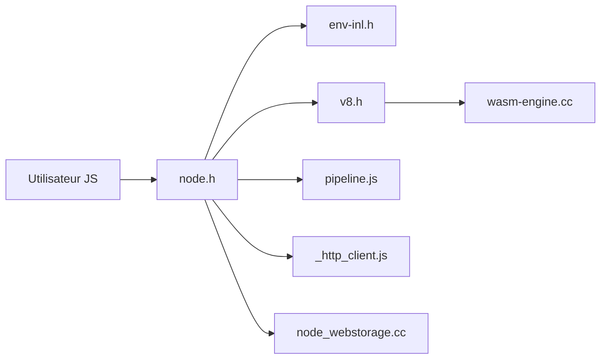

# nodejs/node

> Environnement d'exécution JavaScript open source et multiplateforme, pour développeurs back-end, outillage et scripts.

## Le problème
Exécuter du JavaScript hors du navigateur, avec accès aux fichiers, au réseau et aux flux.

## Ce que ça fait vraiment
Fournit le runtime qui embarque V8 et expose des API : streams, client HTTP, stockage web adossé à SQLite, inspecteur, QUIC, cryptographie. Les versions suivent un cycle : Current, LTS (numéros pairs, 12 mois actifs puis 18 de maintenance) et Nightly. La gouvernance est ouverte, appuyée par l'OpenJS Foundation.

## Comment c'est branché


## Essayer
```bash
curl -fsLo "/path/to/nodejs-keyring.kbx" "https://github.com/nodejs/release-keys/raw/HEAD/gpg/pubring.kbx"
curl -fsO "https://nodejs.org/dist/${VERSION}/SHASUMS256.txt.asc" \
&& gpgv --keyring="/path/to/nodejs-keyring.kbx" --output SHASUMS256.txt < SHASUMS256.txt.asc \
&& shasum --check SHASUMS256.txt --ignore-missing
```
Ces commandes vérifient un binaire téléchargé ; l'installation passe par le site ou BUILDING.md.

## Coût et pièges
Gratuit. Le choix Current ou LTS compte : les Current d'octobre n'ont que 8 mois de support. Compiler depuis les sources est lourd (voir BUILDING.md).

## Ce que ce n'est pas
Pas un framework web ni un gestionnaire de paquets dans ce README. L'architecture interne n'y est pas documentée. La licence est présente mais non identifiée par GitHub : à vérifier.

## Alternatives
Aucune alternative nommée dans le README.

## Pour toi
Adopter, en LTS : c'est la base de tout outillage JS (MCP, dashboards, notebooks) et son cycle de support est clair.

