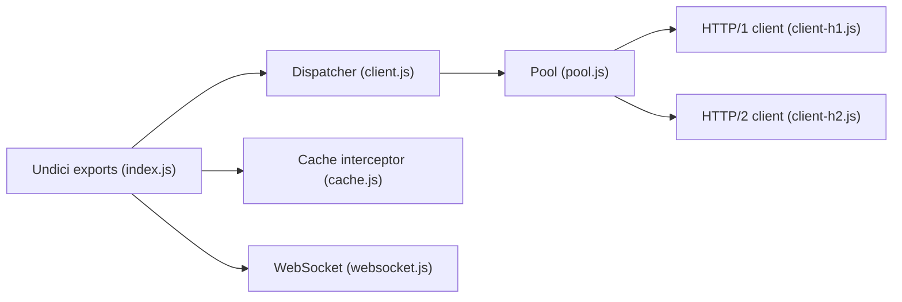

# nodejs/undici

> Client HTTP/1.1 écrit de zéro pour Node.js, avec une implémentation de fetch.

## Le problème
Le module `http` de Node est lourd à utiliser et peu configurable pour le pool de connexions.

## Ce que ça fait vraiment
API `request`, `stream`, `pipeline`, `fetch`, `upgrade`, `connect`, avec dispatcher, pools, HTTP/1 et HTTP/2, pipelining, intercepteurs, cache HTTP (mémoire ou SQLite), `ProxyAgent`, `MockAgent`. `install()` remplace les globaux fetch, WebSocket, EventSource. Le fetch intégré à Node s'appuie sur une version groupée.

## Comment c'est branché


## Essayer
```bash
npm i undici
```
```js
import { request } from 'undici'
const { statusCode, body } = await request('http://localhost:3000/foo')
```

## Coût et pièges
Gratuit. Il faut toujours consommer ou annuler le corps de réponse, sous peine de fuites de connexions. Pas de CORS ni d'`Expect`.

## Ce que ce n'est pas
Pas un client côté navigateur. Les chiffres de benchmark viennent du README (Node 24.14.1).

## Alternatives
Aucune nommée comme choix ; le README compare à node-fetch, axios, got, superagent.

## Pour toi
À surveiller : utile seulement si tu écris du Node (clients d'API LLM) ; sans objet côté Python.

