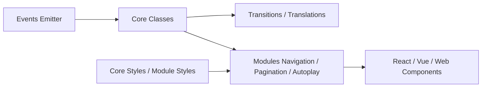

# nolimits4web/swiper

> Carrousel tactile moderne, sans dépendance, pour sites et applications web mobiles.

## Le problème
Faire glisser des diapositives au doigt avec transitions fluides, pagination et navigation sans réécrire la gestion du tactile.

## Ce que ça fait vraiment
Swiper offre un slider avec mouvement tactile 1:1, RTL, grille multi-lignes, effets (fondu, flip, cube 3D, coverflow), boucle, autoplay, lecture différée des images, diapositives virtuelles, accessibilité. Il fonctionne sans jQuery et se charge par modules. Le code est divisé en cœur (events, transitions, breakpoints), modules (navigation, pagination, zoom, thumbs…) et intégrations React, Vue et Web Components.

## Comment c'est branché


## Essayer
```bash
npm install
npm run build
npm run core
npm run react
npm run vue
npm run build:prod
```

## Coût et pièges
Gratuit ; Node pour compiler. Pour la production, n'utiliser que les fichiers du dossier `dist/`. Swiper ne vise que les plateformes modernes.

## Ce que ce n'est pas
Ni un framework d'interface ni un lecteur de médias : un composant de défilement.

## Alternatives
- Aucune alternative nommée dans le README.

## Pour toi
Ignorer : un carrousel d'interface web n'apporte rien à un flux data/IA/MLOps, sauf pour une démo front très précise.

