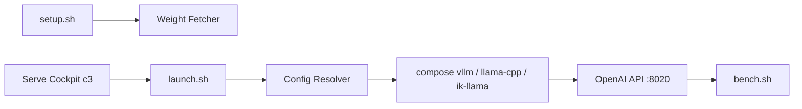

# noonghunna/club-3090

> Recettes et benchmarks pour servir des LLM en local sur une ou deux RTX 3090.

## Le problème
Faire tenir un modèle de 27 milliards de paramètres sur 24 Go de VRAM demande des configurations, des patchs et des choix de moteur difficiles à trouver.

## Ce que ça fait vraiment
Dépôt de configurations docker compose validées, de scripts et de patchs pour vLLM, llama.cpp et ik_llama, avec Qwen3.6-27B comme modèle curaté. Des assistants (`setup.sh`, `launch.sh`, `switch.sh`) téléchargent les poids, choisissent une variante selon le matériel et exposent une API compatible OpenAI sur `localhost:8020`. Benchmarks, tests de stress et rapports de diagnostic sont fournis, ainsi qu'un cockpit TUI `c3`.

## Comment c'est branché


## Essayer
```bash
git clone https://github.com/noonghunna/club-3090.git
cd club-3090
bash scripts/setup.sh
bash scripts/launch.sh
curl -sf http://localhost:8020/v1/chat/completions \
  -H "Content-Type: application/json" \
  -d '{"model":"qwen3.6-27b","messages":[{"role":"user","content":"Capital of France?"}],"max_tokens":200}'
bash scripts/bench.sh
```

## Coût et pièges
Une ou deux RTX 3090, Linux (WSL2 sous Windows), Docker + NVIDIA Container Toolkit, pilote 580+, environ 30 Go par modèle. Sur une carte, un « cliff » de préremplissage reste ouvert au-delà de ~50 K tokens.

## Ce que ce n'est pas
Pas un moteur d'inférence : il assemble vLLM, llama.cpp et ik_llama. Pas fait pour des cartes de 12 Go ni pour macOS/Windows natifs.

## Alternatives
- vLLM, llama.cpp, ik_llama : les moteurs qu'il orchestre, utilisables seuls.

## Pour toi
Adopter si tu as une 3090 et veux servir un LLM local sans tâtonner : chiffres mesurés et scripts reproductibles.
