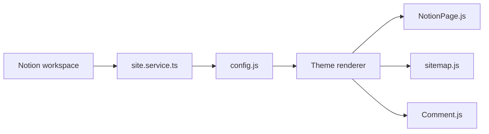

# notionnext-org/NotionNext

> Système de site basé sur Next.js qui publie des pages Notion en blog, documentation ou site produit.

## Le problème
Écrire dans Notion tout en ayant un site indépendant, avec thème, SEO et domaine propres.

## Ce que ça fait vraiment
Charge le contenu via l'API Notion, le traite, le rend avec l'un des 26 thèmes. Ajoute recherche Algolia, commentaires (Twikoo, Giscus…), partage, sitemap, RSS, statistiques ; des points d'accès de chat IA existent dans le code. Déploiement type : modèle Notion, fork, Vercel.

## Comment c'est branché


## Essayer
```bash
nvm use || nvm install
npm i -g yarn
yarn
yarn dev
```

## Coût et pièges
Node 22 et Yarn 1 (Node 20 ne passe plus). Dépend de Notion et de Vercel. README en chinois.

## Ce que ce n'est pas
Pas un CMS autonome : tout vient de Notion. Le README restreint l'usage à l'apprentissage personnel et aux sites légaux.

## Alternatives
Aucune alternative nommée dans le README.

## Pour toi
À ignorer pour un profil data/IA : outil de blog sans lien avec ton travail, sauf si tu publies ta documentation depuis Notion.

