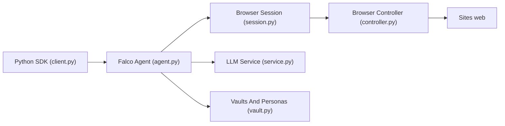

# nottelabs/notte

> Framework Python d'agents web mêlant scripts déterministes et IA, pour automatiser la navigation.

## Le problème
Les agents de navigation purement LLM sont chers et peu fiables ; les scripts seuls cassent dès que la page change.

## Ce que ça fait vraiment
Une session navigateur (Playwright/patchright) est observée, un LLM choisit les actions, un contrôleur les exécute. Sortie structurée via Pydantic, scraping, `AgentFallback` qui déclenche un agent si une étape scriptée échoue. Le mode local est open source ; l'API hébergée ajoute proxies, résolution de CAPTCHA, coffres d'identifiants et personas (email, téléphone, 2FA).

## Comment c'est branché


## Essayer
```bash
pip install notte
patchright install --with-deps chromium
```
```python
import notte
with notte.Session(headless=False) as session:
    agent = notte.Agent(session=session, reasoning_model="gemini/gemini-3.5-flash", max_steps=10)
    response = agent.run(task="Find three cat memes on Google Images and describe them")
```

## Coût et pièges
Local : tes propres clés LLM. Fonctions premium (stealth, vault, personas) : clé API Notte via la console. Le tableau de benchmarks vient de l'éditeur lui-même.

## Ce que ce n'est pas
Ce n'est pas entièrement open source : l'offre « recommandée » est un service hébergé. Les vaults et personas sont pensés pour créer des comptes et contourner des anti-bots.

## Alternatives
- Browser-Use : cité dans le benchmark comme concurrent direct.
- Convergence : autre agent web du même tableau.

## Pour toi
À surveiller : intéressant pour l'automatisation web hybride, mais la licence est à vérifier et les meilleures fonctions passent par leur cloud.
