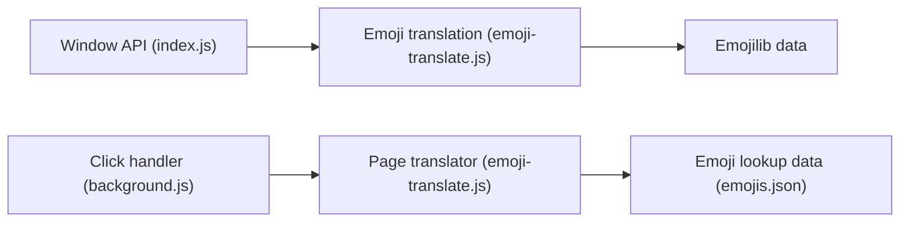

# notwaldorf/emoji-translate

> Bibliothèque JavaScript qui remplace les mots d'un texte par des emojis, avec extension Chrome.

## Le problème
Un texte en anglais manque d'emojis ; le projet est un jeu né d'un hackday.

## Ce que ça fait vraiment
- Cinq méthodes : `isMaybeAlreadyAnEmoji`, `getAllEmojiForWord`, `getEmojiForWord`, `translate`, `translateForDisplay`.
- S'appuie sur emojilib (noms et mots-clés d'emojis).
- Une extension Chrome traduit les textes d'une page web.

## Comment c'est branché


## Essayer
```bash
npm install moji-translate
```
```javascript
translate = require('moji-translate');
console.log(translate.translate("the house is on fire and the cat is eating the cake"));
```

## Coût et pièges
Gratuit. Le paquet npm s'appelle `moji-translate`, pas `emoji-translate`. Dernier push en novembre 2021.

## Ce que ce n'est pas
Pas de traduction sémantique : simple correspondance de mots.

## Alternatives
Aucune alternative nommée dans le README.

## Pour toi
À ignorer : gadget sans usage pour data/IA/MLOps et inactif depuis 2021.

