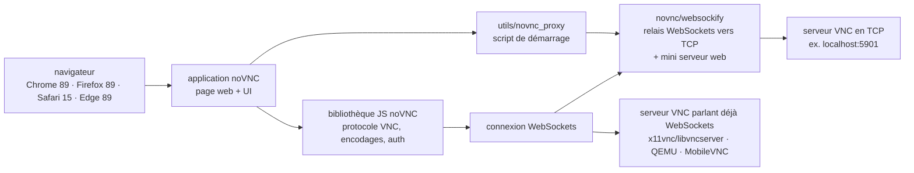

# novnc/noVNC

> **A VNC client that runs in the browser, plus the JavaScript library underneath it.**

## The problem

Giving someone a remote desktop usually means installing a VNC client on every machine, which
works on neither a tablet, nor a locked-down workstation, nor from a web portal where you would
like to open a virtual machine's console in one click. And the VNC protocol speaks raw TCP: a
browser cannot emit that.

## What it actually does

noVNC is two distinct things depending on how you use it: a JavaScript library implementing the
VNC protocol in the browser, and a full application built on top of it — the page you open at
the URL printed on startup to connect to a server. The README claims support for modern
browsers, mobile included (iOS, Android).

The detail that matters is protocol coverage. Authentication: none, classical VNC, RealVNC's
RSA-AES, Tight, VeNCrypt Plain, XVP, Apple's Diffie-Hellman, UltraVNC's MSLogonII. Encodings:
raw, copyrect, rre, hextile, tight, tightPNG, ZRLE, JPEG, Zlib, H.264. On top of that: desktop
scaling, clipping and resizing, back and forward mouse buttons, local cursor rendering,
clipboard copy/paste with full Unicode, translations, and touch gestures emulating common mouse
actions.

The structuring point: noVNC follows the standard VNC protocol but requires WebSockets, unlike
other VNC clients. Some servers ship that support (x11vnc/libvncserver, QEMU, MobileVNC); for
the rest you need a WebSockets-to-TCP-socket proxy, the role of the sister project `websockify`.

## How it is wired



No code-derived diagram exists for this repository: this one is reconstructed from the README
alone. What to read in it is that the WebSockets node is not optional — either the VNC server
speaks it, or `websockify` sits in between.

## Trying it

```bash
./utils/novnc_proxy --vnc localhost:5901
```

The script downloads and starts websockify, which includes a mini web server and the WebSockets
proxy. To avoid exposing the web server to the public internet:

```bash
./utils/novnc_proxy --vnc localhost:5901 --listen localhost:6081
```

Then point the browser at the cut-and-paste URL printed by the script, hit Connect, and enter a
password if the VNC server has one. A snap package also exists:

```bash
sudo snap install novnc
novnc --listen 6081 --vnc localhost:5901 # /snap/bin/novnc if /snap/bin is not in your PATH
novnc --listen 8443 --cert ~jsmith/snap/novnc/current/self.crt --key ~jsmith/snap/novnc/current/self.key --vnc ubuntu.example.com:5901
```

## Cost and traps

- **You already need a running VNC server**: noVNC is a client, it creates no desktop. Every
  command in the README assumes an existing `--vnc localhost:5901`.
- **WebSockets is mandatory**: if the server does not speak it, `websockify` becomes a piece of
  infrastructure to deploy and monitor, not an installation detail.
- **Licence**: the README says "mainly under the MPL 2.0" — the word *mainly* signals components
  under other terms (base64, DES and Pako are listed as included libraries). The catalogue
  records `NOASSERTION`, meaning GitHub could not decide. MPL 2.0 is file-level copyleft: read
  it before embedding the library in a product.
- **Browser floor**: Chrome 89, Firefox 89, Safari 15, Opera 75, Edge 89. The README notes no
  formal requirement list exists, these are the known minimums.
- **Snap confinement**: certificate files must live in `/home/<user>/snap/novnc/current/`,
  otherwise they cannot be read.
- **Snap services**: you disable an instance by setting its values to blank, because snap does
  not allow unsetting a configuration variable.

## What it is not

- **Not a remote desktop server**: nothing is shared without a third-party VNC server on the
  other end. noVNC displays, it does not broadcast.
- **Not an ordinary VNC client**: unlike the others it requires WebSockets, so it does not plug
  straight into any VNC server on the estate.
- **Not a turnkey production product**: the README explicitly defers to separate documents
  (`docs/EMBEDDING.md`, `docs/LIBRARY.md`) for integration and deployment — a sign the shipped
  application is first of all a usable demonstration.
- **Not a collaborative screen-sharing tool** nor its own protocol: it is standard VNC, with its
  latency limits and no documented file transfer.

## Alternatives

| | When to prefer it |
|---|---|
| **novnc/websockify** | Sister project named in the README. Not a competitor but the required complement: take it as soon as the target VNC server does not speak WebSockets. On its own it provides no interface. |
| **LibVNCServer (x11vnc)** | Cited in the README as a server that already includes WebSockets support, and as a noVNC integrator. Worth a look when the need is on the server side, not the client side. |

The neighbours proposed by the catalogue (`h5bp/html5-boilerplate`, `fastapi/fastapi`,
`chartjs/Chart.js`, `fastapi/sqlmodel`) are not comparable: web boilerplate, a Python HTTP
framework and a charting library, brought close by web-development vocabulary alone, with no
relation to remote desktop access.

## For you

Useful whenever a graphical console must be opened from a portal: GPU workstation, remote
desktop inside a container, test machine. The README cites OpenStack, OpenNebula and ThinLinc
among integrators — this is the standard brick for that use, and the library embeds into a
homemade interface. Skip it if command-line access is what you need: SSH costs infinitely less
than a stream of images.
