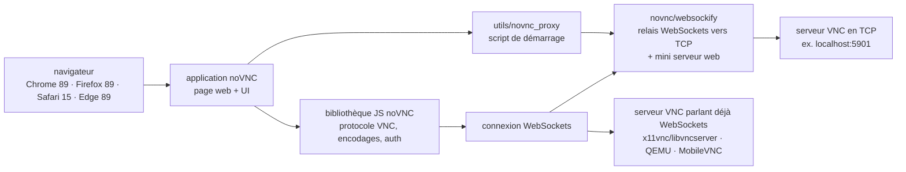

# novnc/noVNC

> **Un client VNC qui tourne dans le navigateur, et la bibliothèque JavaScript qu'il y a dessous.**

## Le problème

Donner accès à un bureau distant suppose d'ordinaire d'installer un client VNC sur chaque
poste, ce qui ne marche ni sur une tablette, ni sur une machine verrouillée, ni depuis un
portail web où l'on voudrait ouvrir la console d'une machine virtuelle en un clic. Et le
protocole VNC parle TCP brut : un navigateur ne sait pas l'émettre.

## Ce que ça fait vraiment

noVNC est deux choses distinctes selon l'usage : une bibliothèque JavaScript qui implémente le
protocole VNC côté navigateur, et une application complète bâtie dessus, celle qu'on ouvre à
l'URL affichée au démarrage pour se connecter à un serveur. Le README annonce le support des
navigateurs modernes, mobiles compris (iOS, Android).

Le détail qui compte est la couverture du protocole. Côté authentification : aucune,
VNC classique, RSA-AES de RealVNC, Tight, VeNCrypt Plain, XVP, Diffie-Hellman d'Apple,
MSLogonII d'UltraVNC. Côté encodages : raw, copyrect, rre, hextile, tight, tightPNG, ZRLE,
JPEG, Zlib, H.264. S'y ajoutent la mise à l'échelle, le rognage et le redimensionnement du
bureau, les boutons précédent/suivant de la souris, le rendu local du curseur, le
copier-coller presse-papiers avec Unicode complet, les traductions et des gestes tactiles qui
émulent les actions de souris usuelles.

Le point structurant : noVNC suit le protocole VNC standard mais exige WebSockets, ce que les
clients VNC classiques ne font pas. Certains serveurs l'embarquent (x11vnc/libvncserver, QEMU,
MobileVNC) ; pour les autres, il faut un relais WebSockets vers socket TCP, rôle tenu par le
projet frère `websockify`.

## Comment c'est branché



Aucun diagramme tiré du code n'existe pour ce dépôt : ce schéma est reconstruit depuis le seul
README. Ce qu'il faut y lire, c'est que le nœud WebSockets n'est pas optionnel — soit le
serveur VNC le parle, soit `websockify` s'intercale.

## Essayer

```bash
./utils/novnc_proxy --vnc localhost:5901
```

Le script télécharge et démarre websockify, qui embarque un mini serveur web et le relais
WebSockets. Pour ne pas exposer le serveur web sur l'internet public :

```bash
./utils/novnc_proxy --vnc localhost:5901 --listen localhost:6081
```

Puis pointer le navigateur sur l'URL à copier-coller affichée par le script, cliquer sur
Connect et saisir le mot de passe si le serveur VNC en a un. Il existe aussi un paquet snap :

```bash
sudo snap install novnc
novnc --listen 6081 --vnc localhost:5901 # /snap/bin/novnc si /snap/bin n'est pas dans le PATH
novnc --listen 8443 --cert ~jsmith/snap/novnc/current/self.crt --key ~jsmith/snap/novnc/current/self.key --vnc ubuntu.example.com:5901
```

## Coût et pièges

- **Il faut déjà un serveur VNC qui tourne** : noVNC est un client, il ne crée aucun bureau.
  Toutes les commandes du README supposent un `--vnc localhost:5901` existant.
- **WebSockets obligatoire** : si le serveur ne le parle pas, `websockify` devient une pièce
  d'infrastructure à déployer et à surveiller en plus, pas un détail d'installation.
- **Licence** : le README annonce « mainly under the MPL 2.0 » — le mot *mainly* signale des
  composants sous d'autres termes (base64, DES, Pako sont listés comme bibliothèques incluses).
  Le catalogue relève par ailleurs `NOASSERTION`, c'est-à-dire que GitHub n'a pas su trancher.
  MPL 2.0 est un copyleft de fichier : à lire avant d'embarquer la bibliothèque dans un produit.
  D'où les deux alertes.
- **Plancher navigateur** : Chrome 89, Firefox 89, Safari 15, Opera 75, Edge 89. Le README
  précise qu'aucune liste formelle d'exigences n'existe, ce sont les minima connus.
- **Confinement snap** : les fichiers de certificat doivent se trouver dans
  `/home/<user>/snap/novnc/current/`, sinon ils ne sont pas lisibles.
- **Services snap** : on désactive une instance en mettant ses valeurs à blanc, car snap ne
  permet pas de supprimer une variable de configuration.

## Ce que ce n'est pas

- **Ce n'est pas un serveur de bureau distant** : rien n'est partagé sans un serveur VNC tiers
  en face. noVNC affiche, il ne diffuse pas.
- **Ce n'est pas un client VNC ordinaire** : contrairement aux autres, il exige WebSockets, donc
  il ne se branche pas tel quel sur n'importe quel serveur VNC du parc.
- **Ce n'est pas un produit clé en main pour la production** : le README renvoie explicitement à
  des documents séparés (`docs/EMBEDDING.md`, `docs/LIBRARY.md`) pour l'intégration et le
  déploiement — signe que l'application livrée est d'abord une démonstration utilisable.
- **Ce n'est pas un outil de partage d'écran collaboratif** ni un protocole propre : c'est du
  VNC standard, avec ses limites de latence et son absence de transfert de fichiers documenté.

## Alternatives

| | Quand le préférer |
|---|---|
| **novnc/websockify** | Projet frère nommé dans le README. Ce n'est pas un concurrent mais le complément obligé : à prendre dès que le serveur VNC visé ne parle pas WebSockets. Seul, il ne fournit aucune interface. |
| **LibVNCServer (x11vnc)** | Cité dans le README comme serveur incluant déjà le support WebSockets, et comme intégrateur de noVNC. À regarder quand le besoin est côté serveur, pas côté client. |

Les voisins proposés par le catalogue (`h5bp/html5-boilerplate`, `fastapi/fastapi`,
`chartjs/Chart.js`, `fastapi/sqlmodel`) ne sont pas comparables : ce sont des gabarits web, un
cadre HTTP Python et une bibliothèque de graphiques, rapprochés par le seul lexique du
développement web, sans rapport avec l'accès à un bureau distant.

## Pour toi

Utile dès qu'il faut ouvrir une console graphique depuis un portail : machine de travail GPU,
bureau distant dans un conteneur, poste de recette. Le README cite OpenStack, OpenNebula et
ThinLinc parmi les intégrateurs — c'est la brique standard pour cet usage, et la bibliothèque
s'embarque dans une interface maison. À écarter si l'on cherche un accès en ligne de commande :
SSH coûte infiniment moins cher qu'un flux d'images.
