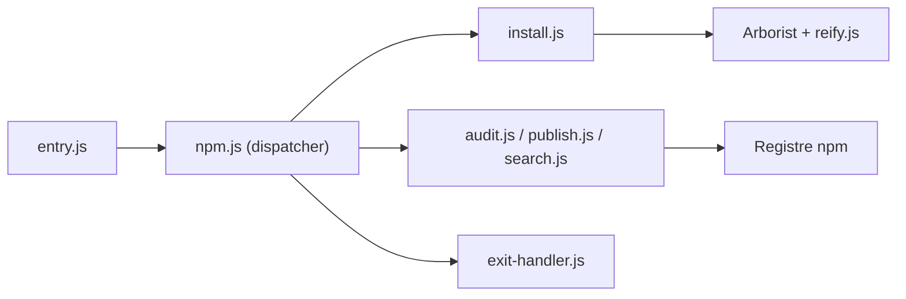

# npm/cli

> Gestionnaire de paquets JavaScript, livré avec Node.js, pour installer, publier et auditer des paquets.

## Le problème
Gérer les dépendances JavaScript, leurs versions, et publier ou auditer des paquets à la main est impossible à grande échelle.

## Ce que ça fait vraiment
La CLI répartit chaque commande, résout l'arbre de dépendances (Arborist), l'écrit sur le disque (reify), et parle au registre par défaut `registry.npmjs.org` (configurable). Elle couvre `install`, `search`, `publish`, `query`, `audit`, `exec`, `config`, `version` et l'authentification.

## Comment c'est branché


## Essayer
```bash
curl -qL https://www.npmjs.com/install.sh | sh
npm <command>
```

## Coût et pièges
Gratuit. Le registre public est soumis à des conditions d'utilisation. La licence est présente mais non identifiée par GitHub : à vérifier avant de redistribuer.

## Ce que ce n'est pas
Pas un gestionnaire pour Python ou pour les environnements ML. Le README ne dit rien de sa licence exacte.

## Alternatives
Aucune alternative nommée dans le README.

## Pour toi
À ignorer comme sujet de veille : il arrive avec Node et n'ajoute rien pour un profil data/IA, sauf si tu publies des paquets JavaScript.

