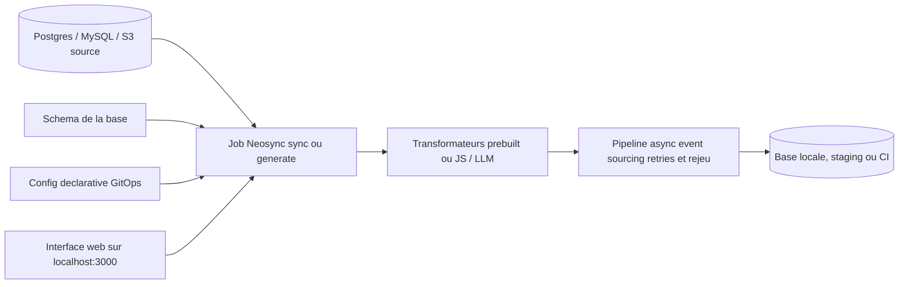

# nucleuscloud/neosync

> **Anonymize production data and generate synthetic data to populate test environments.**

## The problem

Without a tool like this, you either copy production data as-is into lower environments — putting PII on developer laptops along with the GDPR/HIPAA scope that comes with it — or you hand-craft fixtures that match neither the volume nor the awkward edge cases. Reproducing a production bug locally then becomes guesswork.

## What it actually does

Neosync orchestrates data jobs between databases: it generates synthetic data from your schema, anonymizes existing data, and subsets a production database using any SQL query. Per the README it preserves referential integrity automatically. The pipeline is asynchronous and handles retries, failures and playback through an event-sourcing model. It ships pre-built transformers for common data types and lets you write custom ones in JavaScript or backed by LLMs. Announced integrations: Postgres, MySQL, S3. Configs are declarative and GitOps-style, meant to run as a CI step. One critical point: the README itself states the repository is no longer actively maintained following the acquisition by Grow Therapy.

## How it is wired



The declarative config and the database schema feed a job, which applies transformers — pre-built, JavaScript or LLM-backed — and pushes the result to the target environment through an asynchronous pipeline able to replay what failed. Everything is driven from a UI served on port 3000. No code-derived diagram was available, so this graph is inferred from the README alone and names no real source files.

## Trying it

```sh
make compose/up
```

```sh
make compose/down
```

The README says to clone the repo, have Docker installed and running, and have the newer `docker compose` command available. The app is then served at http://localhost:3000, with connections and jobs pre-seeded by the production compose file.

## Cost and traps

The software is free and the README claims an MIT expat license, but the GitHub API reports `NOASSERTION` — worth checking before any corporate use. The real cost lies elsewhere: the repository is declared unmaintained after the Grow Therapy acquisition, so expect no security fixes. You need Docker and enough resources to run a full containerized stack. Custom "LLM" transformers imply a model provider the README names neither by vendor nor by price. Kubernetes, environment variables and auth mode all point to vendor-hosted external docs.

## What it is not

It is not a live product: the banner at the top of the README is explicit. It is not a database migration or replication tool either — it produces derived datasets for testing, not a faithful copy. It is not a compliance guarantee: it narrows GDPR/HIPAA scope rather than removing it, and anonymization quality depends on the transformers you configure. Finally, connector coverage is limited to what is announced — Postgres, MySQL, S3.

## Alternatives

- **airbytehq/airbyte** — if the actual need is moving data between systems rather than anonymizing it; hundreds of connectors, but no synthetic data generation.
- For anonymization and synthetic data proper, no comparable alternative in the catalogue: the other supplied neighbours (ToolJet, gogs, gitea) belong to unrelated domains, and the README names no competitor.

## For you

The topic — realistic test datasets without PII — is a genuine pain point for data and MLOps teams, and the "subset + referential integrity + replayable pipeline" approach is worth reading even as-is. But an explicitly abandoned repository does not go to production: install it to learn from it or to solve a one-off need, not as a durable building block.
