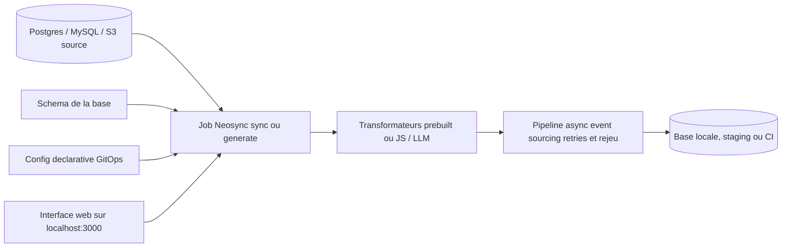

# nucleuscloud/neosync

> **Anonymiser des données de production et en générer de synthétiques pour peupler les environnements de test.**

## Le problème

Sans outil de ce genre, on teste soit sur des données de production copiées telles quelles — donc des PII en clair sur des postes de dev, avec le périmètre RGPD/HIPAA qui va avec —, soit sur des jeux de test bricolés qui ne reproduisent ni le volume ni les cas tordus. Reproduire un bug de prod localement devient alors un exercice d'imagination.

## Ce que ça fait vraiment

Neosync orchestre des jobs de données entre bases : il génère des données synthétiques à partir de ton schéma, anonymise des données existantes, et découpe un sous-ensemble de ta base de production à partir d'une requête SQL quelconque. Il maintient l'intégrité référentielle automatiquement d'après le README. Le pipeline est asynchrone et gère relances, échecs et rejeu via un modèle d'event sourcing. Il fournit des transformateurs préconstruits pour les types de données courants, et permet d'en écrire des personnalisés en JavaScript ou via des LLM. Les intégrations annoncées : Postgres, MySQL, S3. Les configurations sont déclaratives, style GitOps, pour être posées comme étape d'une CI. Point important : le README lui-même annonce que le dépôt n'est plus activement maintenu depuis le rachat par Grow Therapy.

## Comment c'est branché



La configuration déclarative et le schéma de la base alimentent un job, qui applique les transformateurs — préconstruits ou écrits en JavaScript / adossés à un LLM — et pousse le résultat vers l'environnement cible via un pipeline asynchrone qui sait rejouer ce qui a échoué. L'ensemble se pilote depuis une interface disponible sur le port 3000. Aucun diagramme issu du code n'était disponible : ce schéma est déduit du seul README, il ne nomme donc aucun fichier réel.

## Essayer

```sh
make compose/up
```

```sh
make compose/down
```

Le README précise qu'il faut cloner le dépôt, avoir Docker installé et lancé, et disposer de la commande récente `docker compose`. L'application est ensuite servie sur http://localhost:3000, avec des connexions et des jobs pré-amorcés par le compose de production.

## Coût et pièges

Le logiciel est gratuit et le README revendique une licence MIT expat, mais l'API GitHub renvoie `NOASSERTION` : à vérifier avant tout usage en entreprise. Le vrai coût est ailleurs : le dépôt est déclaré non maintenu suite au rachat par Grow Therapy, donc pas de correctif de sécurité à attendre. Il faut Docker et de quoi faire tourner une pile complète en conteneurs. Les transformateurs personnalisés « via LLM » supposent un fournisseur de modèle, dont le README ne dit ni lequel ni à quel prix. Kubernetes, variables d'environnement et mode auth renvoient à une documentation externe hébergée par l'éditeur.

## Ce que ce n'est pas

Ce n'est pas un produit vivant : l'avertissement en tête de README est explicite, le dépôt n'est plus activement maintenu. Ce n'est pas non plus un outil de migration ou de réplication de bases — il produit des jeux de données dérivés pour le test, pas une copie fidèle. Ce n'est pas une garantie de conformité : il réduit le périmètre RGPD/HIPAA, il ne le supprime pas, et la qualité de l'anonymisation dépend des transformateurs que tu configures. Enfin, la couverture de connecteurs se limite à ce qui est annoncé — Postgres, MySQL, S3.

## Alternatives

- **airbytehq/airbyte** — si le besoin réel est de déplacer des données entre systèmes plutôt que de les anonymiser ; il a des centaines de connecteurs mais ne fait pas de génération synthétique.
- Pour l'anonymisation et les données synthétiques elles-mêmes, aucune alternative comparable dans le catalogue : les autres voisins fournis (ToolJet, gogs, gitea) relèvent de domaines sans rapport, et le README ne cite aucun concurrent.

## Pour toi

Le sujet — jeux de test réalistes sans PII — est un vrai point de douleur des équipes data et MLOps, et l'approche « subset + intégrité référentielle + pipeline rejouable » vaut la lecture même en l'état. Mais un dépôt explicitement abandonné ne se met pas en production : à installer pour s'en inspirer ou dépanner un besoin ponctuel, pas à adopter comme brique durable.
