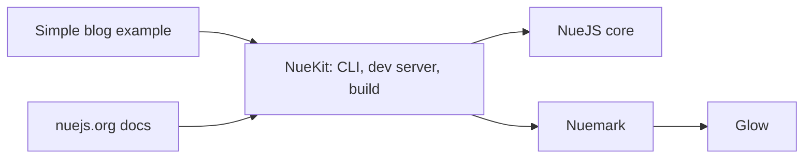

# nuejs/nue

> Monorepo d'un framework web (NueKit) ; le README fourni ne donne que le chemin d'un autre README.

## Le problème
Non documenté dans le README lu : il ne contient que la ligne `packages/nuekit/README.md`.

## Ce que ça fait vraiment
Fiche minimale, faute de matière. D'après l'architecture décrite d'après le code : un monorepo avec `nuekit` (outil de build, serveur de développement, rechargement à chaud, transitions de vue), `nuejs` (composants, templates, runtime navigateur), `nuemark` (moteur Markdown) et `glow` (coloration syntaxique), plus un site de docs et un exemple de blog. Cette description est générée et non vérifiée.

## Comment c'est branché

## Essayer
Aucune commande documentée dans le README lu.

## Coût et pièges
Non documenté. Le prérequis d'exécution n'est pas indiqué dans la matière fournie.

## Ce que ce n'est pas
Ce n'est pas évalué ici : sans README exploitable, aucune promesse du projet n'a pu être vérifiée.

## Alternatives
Aucune alternative nommée dans le README.

## Pour toi
Ignorer : matière insuffisante pour trancher, et un framework web n'entre pas dans un travail data/IA/MLOps ; relire le README de `packages/nuekit` avant tout jugement.

