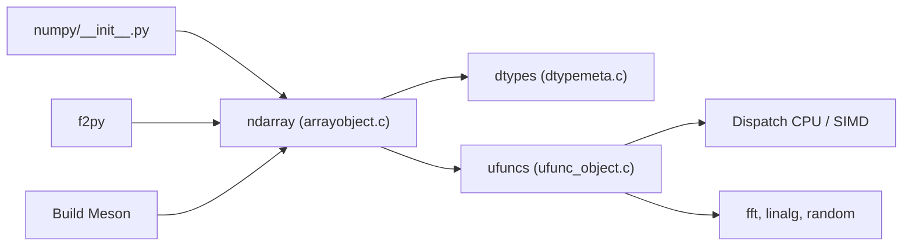

# numpy/numpy

> Bibliothèque de calcul scientifique Python centrée sur le tableau N-dimensionnel, socle de l'écosystème data.

## Le problème
Les listes Python sont lentes et peu adaptées aux calculs numériques sur de grands volumes, sans opérations vectorisées ni algèbre linéaire intégrée.

## Ce que ça fait vraiment
Fournit l'objet ndarray, des fonctions de diffusion (broadcasting), l'algèbre linéaire, la FFT, les nombres aléatoires et des outils pour intégrer du C, C++ et Fortran. D'après le code : les appels passent par les ufuncs, qui choisissent des boucles par dtype, avec un dispatch CPU (SIMD) à l'exécution. F2PY génère des liaisons Fortran et le build repose sur Meson.

## Comment c'est branché


## Essayer
```bash
python -c "import numpy, sys; sys.exit(numpy.test() is False)"
```
Le README n'affiche pas de commande d'installation.

## Coût et pièges
Gratuit. Les tests demandent pytest, et éventuellement Meson, Cython et Hypothesis. BLAS/LAPACK externe : dépendance de build et d'exécution notable. Licence non identifiée par GitHub.

## Ce que ce n'est pas
Ce n'est pas une bibliothèque de dataframes ni d'apprentissage : il faut pandas, scikit-learn ou PyTorch au-dessus. Pas de calcul GPU natif dans le README.

## Alternatives
Aucune alternative citée dans le README.

## Pour toi
À adopter, évidemment : c'est le socle de presque tout l'outillage Python data/IA, avec une communauté large et un suivi actif.

