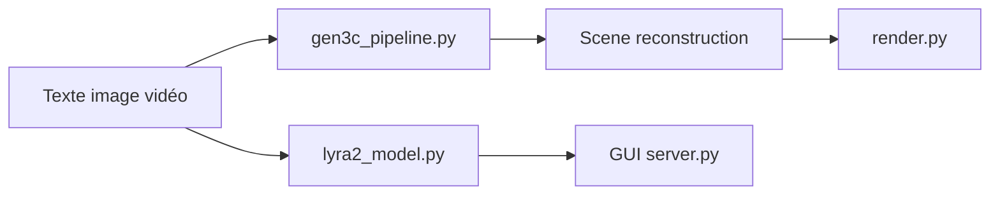

# nv-tlabs/lyra

> Implémentations officielles NVIDIA de Lyra 1.0 et 2.0, modèles génératifs de mondes 3D, pour chercheurs.

## Le problème
Générer des scènes 3D explorables à partir de texte, d'image ou de vidéo demande de relier génération vidéo et reconstruction.

## Ce que ça fait vraiment
Le README est quasi vide : un tableau renvoyant vers articles arXiv, pages projet, poids Hugging Face et dossiers `Lyra-1/` et `Lyra-2/`. D'après l'architecture du code : Lyra 1 combine diffusion, génération vidéo autorégressive et reconstruction feed-forward ; Lyra 2 ajoute des mondes longs et une interface graphique client/serveur. Entraînement et tokenizer vidéo inclus. Instructions d'usage non documentées ici.

## Comment c'est branché

## Essayer
Aucune commande documentée dans le README ; voir les README de `Lyra-1/` et `Lyra-2/` (non lus).

## Coût et pièges
GPU NVIDIA lourd vraisemblable, non précisé. Poids à télécharger depuis Hugging Face.

## Ce que ce n'est pas
Pas un produit clé en main : une base de recherche dont le mode d'emploi est ailleurs.

## Alternatives
Aucune alternative nommée dans le README.

## Pour toi
À surveiller : intéressant pour suivre la recherche en mondes 3D génératifs, mais impossible de juger l'installation sans lire les sous-dossiers ; Apache-2.0 et éditeur solide.

