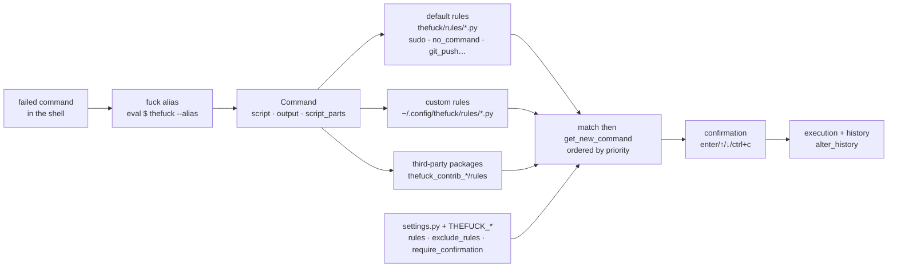

# nvbn/thefuck

> **A shell alias that reads your last failed command, proposes a corrected one and runs it.**

## The problem

Half the commands that fail in a terminal fail for a mechanical, well-known reason: a missing
`sudo`, a typo (`puthon`, `git brnch`, `lein rpl`), the `--set-upstream` that git spells out in
its own error message, a parent directory that does not exist. You read the message, scroll back
through history, retype. The fix is already printed in the error output; the human is doing the
copy-paste.

## What it actually does

*The Fuck* installs as a shell alias (`eval $(thefuck --alias)`, with a free choice of alias
name). Invoked after a failure, it takes the previous command and its output and matches them
against a catalogue of **rules**. Each rule is a Python module exposing two functions,
`match(command) -> bool` and `get_new_command(command) -> str | list[str]`, plus the optional
`side_effect`, `enabled_by_default`, `requires_output` and `priority`. The first matching rule
produces a corrected command, offered with `[enter/↑/↓/ctrl+c]` — several candidates are browsed
with the arrow keys — then executed in the current shell.

The README lists the default catalogue: over a hundred rules, dominated by git (`git_push`,
`git_not_command`, `git_stash`, `git_branch_delete`…), then package managers (apt, brew, pacman,
dnf, yum, npm, yarn, pip, gem, cargo, composer), build tools (gradle, mvn, lein, grunt, gulp),
cloud tooling (aws, az, heroku, docker, terraform, tsuru) and generic fixes: `sudo`, `no_command`
(unknown command corrected by similarity), `history`, `switch_lang` (command typed in the wrong
keyboard layout), `remove_shell_prompt_literal` (the `$` pasted along with a command from
documentation). Two rules ship but stay off by default: `git_push_force` and `rm_root`.

What it does not do itself: guess. With no matching rule there is no correction. Behaviour is
tuned in `$XDG_CONFIG_HOME/thefuck/settings.py` (`rules`, `exclude_rules`,
`require_confirmation`, `priority`, `history_limit`, `wait_command`, `slow_commands`…) or through
equivalent `THEFUCK_*` environment variables. Custom rules go into `~/.config/thefuck/rules`, and
third-party packages named `thefuck_contrib_*` are discovered automatically if they expose a
`rules` module.

## How it is wired



No code-derived diagram exists for this repository: the graph is reconstructed from the README
alone, using the paths and function names it cites.

## Trying it

```bash
brew install thefuck
```

On Ubuntu / Mint, on other systems, and to upgrade:

```bash
sudo apt update
sudo apt install python3-dev python3-pip python3-setuptools
pip3 install thefuck --user

pip install thefuck

pip3 install thefuck --upgrade
```

Then, in `.bash_profile`, `.bashrc`, `.zshrc` or another startup script:

```bash
eval $(thefuck --alias)
# You can use whatever you want as an alias, like for Mondays:
eval $(thefuck --alias FUCK)
```

Changes only apply in a new shell session, or after `source ~/.bashrc`. The documented run-time
options:

```bash
fuck --yeah
fuck -r
```

And instant mode, which logs output through `script(1)` instead of re-running the command:

```bash
eval $(thefuck --alias --enable-experimental-instant-mode)
```

## Cost and pitfalls

- **Free, no third-party service, no key**: one pip package and one alias. The cost is not
  financial.
- **The real cost is automatic execution.** The tool does not only suggest, it runs.
  `require_confirmation` defaults to `True`, but the README documents how to turn it off, along
  with `--yeah` / `-y` / `--hard` and `-r` (retry recursively until success). The catalogue
  contains `sudo`, `sudo_command_from_user_path`, `rm_dir` (adds `-rf`), `git_push_force` and
  `rm_root` (adds `--no-preserve-root` to `rm -rf /`) — the last two off by default, which says
  enough about what enabling them costs.
- **Requirements**: Python 3.5+, `pip`, `python-dev` — on Ubuntu that means installing
  `python3-dev` first, and a `--user` install puts the binary outside the default `PATH` on some
  systems.
- **Instant mode is declared experimental** and only supports Python 3 with bash or zsh; zsh's
  autocorrect must be disabled for thefuck to work properly.
- **Latency**: outside instant mode the tool re-runs the previous command to capture its output,
  hence `wait_command`, `wait_slow_command` and `slow_commands` in the settings. The README opens
  on the question "too slow?". Re-running a command with side effects is not neutral.
- **`alter_history` defaults to `True`**: the fixed command is pushed into shell history.
- Uninstalling takes two steps, removing the alias line *and* uninstalling the package.

## What it is not

- **It is not a natural-language assistant.** No model, no network call: it is a hand-written
  rule engine. Outside the anticipated patterns it proposes nothing, and the README documents no
  fallback.
- **It is not an intent corrector**: it fixes the *form* of a command from its error message, not
  what you meant to do. `no_command` and `history` work by lexical similarity, so sometimes
  towards the wrong command — hence the confirmation step.
- **It is not a safety net**: it stops nothing; on the contrary it adds `sudo`, `-rf` or
  `--force` exactly where the error came from a protection. The README says as much, talking
  about "blindly running corrected commands".
- **It is not a library you import**: the documented public surface is a shell alias and a rule
  API, not a module you call from your own code.
- **It is not shell-independent**: the alias is set up per shell (bash, zsh, fish, powershell,
  tcsh) and instant mode excludes most of them.

## Alternatives

No comparable alternative in the catalogue: the proposed neighbours
(`harry0703/MoneyPrinterTurbo`, `opendatalab/MinerU`, `vnpy/vnpy`, `frappe/erpnext`) are
respectively a video generator, a document extractor, a trading platform and an ERP — the
proximity comes from shared Python vocabulary, not from the subject. The README names no
competing tool; it only cites `skycocker/chromebrew` as an install channel on ChromeOS and the
`thefuck_contrib_*` convention for extending the tool rather than replacing it.

## For you

Little to do with data or MLOps as such, but a real daily gain for anyone living in a terminal:
git, pip, conda (`conda_mistype`), docker and terraform are broadly covered, and
`python_module_error` attempts a `pip install` of the missing module. Two reservations before
installing it on a machine that matters: the tool executes rather than advises — so keep
`require_confirmation` on and never make `--yeah` a habit — and the repository remains one
person's, which makes it a personal convenience rather than a dependency to put in a build image
or on a shared server.
