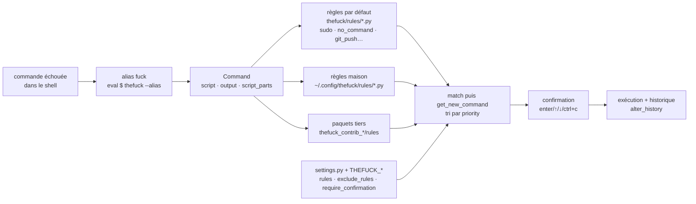

# nvbn/thefuck

> **Un alias de terminal qui relit la commande précédente ratée, propose une version corrigée et l'exécute.**

## Le problème

Une commande sur deux qui échoue dans un terminal échoue pour une raison mécanique et connue :
un `sudo` manquant, une faute de frappe (`puthon`, `git brnch`, `lein rpl`), un `--set-upstream`
que git réclame dans son propre message d'erreur, un répertoire parent inexistant. On lit le
message, on remonte dans l'historique, on retape. Le correctif est déjà écrit dans la sortie
d'erreur, mais c'est l'humain qui fait le copier-coller.

## Ce que ça fait vraiment

*The Fuck* s'installe comme un alias shell (`eval $(thefuck --alias)`, le nom de l'alias étant
libre). Appelé après un échec, il récupère la commande précédente et sa sortie, et la confronte
à un catalogue de **règles**. Chaque règle est un module Python exposant deux fonctions,
`match(command) -> bool` et `get_new_command(command) -> str | list[str]`, plus les optionnelles
`side_effect`, `enabled_by_default`, `requires_output` et `priority`. La première règle qui
correspond produit une commande corrigée, proposée avec `[enter/↑/↓/ctrl+c]` — plusieurs
candidats se parcourent aux flèches — puis exécutée dans le shell courant.

Le README énumère le catalogue par défaut : plus d'une centaine de règles, dominées par git
(`git_push`, `git_not_command`, `git_stash`, `git_branch_delete`…), plus les gestionnaires de
paquets (apt, brew, pacman, dnf, yum, npm, yarn, pip, gem, cargo, composer), les outils de build
(gradle, mvn, lein, grunt, gulp), le cloud (aws, az, heroku, docker, terraform, tsuru) et des
correctifs génériques : `sudo`, `no_command` (commande inexistante corrigée par proximité),
`history`, `switch_lang` (commande tapée dans la mauvaise disposition clavier),
`remove_shell_prompt_literal` (le `$` collé en tête d'une commande copiée d'une doc).
Deux règles existent mais sont désactivées par défaut : `git_push_force` et `rm_root`.

Ce qu'il ne fait pas lui-même : deviner. Hors règle qui correspond, il n'y a pas de correction.
Le comportement se règle dans `$XDG_CONFIG_HOME/thefuck/settings.py` (`rules`, `exclude_rules`,
`require_confirmation`, `priority`, `history_limit`, `wait_command`, `slow_commands`…) ou par
variables d'environnement `THEFUCK_*` équivalentes. Des règles maison se déposent dans
`~/.config/thefuck/rules`, et des paquets tiers nommés `thefuck_contrib_*` sont découverts
automatiquement s'ils exposent un module `rules`.

## Comment c'est branché



Aucun diagramme tiré du code n'existe pour ce dépôt : ce schéma est reconstruit depuis le seul
README, à partir des chemins et noms de fonctions qu'il cite.

## Essayer

```bash
brew install thefuck
```

Sur Ubuntu / Mint, sur les autres systèmes, et pour la mise à jour :

```bash
sudo apt update
sudo apt install python3-dev python3-pip python3-setuptools
pip3 install thefuck --user

pip install thefuck

pip3 install thefuck --upgrade
```

Puis, dans `.bash_profile`, `.bashrc`, `.zshrc` ou autre script de démarrage :

```bash
eval $(thefuck --alias)
# You can use whatever you want as an alias, like for Mondays:
eval $(thefuck --alias FUCK)
```

Les changements ne sont visibles que dans un nouveau shell, ou après `source ~/.bashrc`. Les
options d'exécution documentées :

```bash
fuck --yeah
fuck -r
```

Et le mode instantané, qui journalise la sortie via `script(1)` au lieu de rejouer la commande :

```bash
eval $(thefuck --alias --enable-experimental-instant-mode)
```

## Coût et pièges

- **Gratuit, sans service tiers, sans clé** : un paquet pip et un alias. Le coût n'est pas
  financier.
- **Le vrai coût est l'exécution automatique.** L'outil ne suggère pas seulement, il exécute.
  `require_confirmation` vaut `True` par défaut mais le README documente comment le désactiver,
  ainsi que `--yeah` / `-y` / `--hard` et `-r` (réessayer récursivement jusqu'à réussite).
  Le catalogue contient `sudo`, `sudo_command_from_user_path`, `rm_dir` (ajoute `-rf`),
  `git_push_force` et `rm_root` (ajoute `--no-preserve-root` à `rm -rf /`) — ces deux dernières
  désactivées par défaut, ce qui indique assez ce que coûte leur activation.
- **Prérequis** : Python 3.5+, `pip`, `python-dev` — sur Ubuntu cela signifie installer
  `python3-dev` avant, et l'installation `--user` place le binaire hors du `PATH` par défaut sur
  certains systèmes.
- **Le mode instantané est déclaré expérimental** et ne couvre que Python 3 avec bash ou zsh ;
  la correction automatique de zsh doit être désactivée pour que thefuck fonctionne correctement.
- **Latence** : hors mode instantané, l'outil re-exécute la commande précédente pour en obtenir
  la sortie, d'où `wait_command`, `wait_slow_command` et `slow_commands` dans les réglages. Le
  README ouvre d'ailleurs sur la question « trop lent ? ». Re-exécuter une commande qui a des
  effets de bord n'est pas neutre.
- **`alter_history` vaut `True`** : la commande corrigée est poussée dans l'historique du shell.
- La désinstallation demande deux gestes, retirer la ligne d'alias *et* désinstaller le paquet.

## Ce que ce n'est pas

- **Ce n'est pas un assistant en langage naturel.** Aucun modèle, aucun appel réseau : c'est un
  moteur de règles écrites à la main. Hors des motifs prévus, il ne propose rien — et le README
  ne documente aucun mécanisme de repli.
- **Ce n'est pas un correcteur d'intention** : il corrige la *forme* d'une commande à partir de
  son message d'erreur, pas ce que vous vouliez faire. `no_command` et `history` fonctionnent par
  ressemblance lexicale, donc parfois vers la mauvaise commande — d'où la confirmation.
- **Ce n'est pas un garde-fou** : il ne vous empêche de rien, il ajoute au contraire `sudo`,
  `-rf` ou `--force` là où l'erreur venait d'une protection. Le README le dit lui-même en
  parlant de « blindly running corrected commands ».
- **Ce n'est pas une bibliothèque à importer** : la surface publique documentée est un alias
  shell et une API de règles, pas un module qu'on appelle depuis son code.
- **Ce n'est pas indépendant du shell** : l'alias se pose par shell (bash, zsh, fish,
  powershell, tcsh) et le mode instantané en exclut la plupart.

## Alternatives

Aucune alternative comparable dans le catalogue : les voisins proposés
(`harry0703/MoneyPrinterTurbo`, `opendatalab/MinerU`, `vnpy/vnpy`, `frappe/erpnext`) sont
respectivement un générateur de vidéos, un extracteur de documents, une plateforme de trading et
un ERP — le rapprochement vient du lexique Python, pas du sujet. Le README ne nomme aucun outil
concurrent ; il ne cite que `skycocker/chromebrew` comme canal d'installation sur ChromeOS et la
convention `thefuck_contrib_*` pour étendre l'outil plutôt que le remplacer.

## Pour toi

Peu de rapport avec la data ou le MLOps en tant que tel, mais un gain quotidien réel pour qui
vit dans un terminal : git, pip, conda (`conda_mistype`), docker et terraform sont largement
couverts, et `python_module_error` tente un `pip install` du module manquant. Deux réserves
avant de l'installer sur une machine qui compte : l'outil exécute, il ne conseille pas — donc à
garder avec `require_confirmation` activé, jamais `--yeah` par habitude — et le dépôt reste celui
d'une personne, ce qui en fait un confort personnel plutôt qu'une dépendance à mettre dans une
image de build ou sur un serveur partagé.
