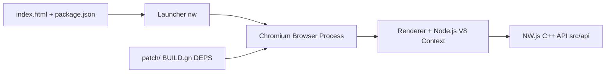

# nwjs/nw.js

> Environnement d'exécution mêlant Chromium et Node.js pour écrire des applications de bureau en HTML et JavaScript.

## Le problème
Livrer une application de bureau avec des technologies web, tout en appelant directement des modules Node depuis la page.

## Ce que ça fait vraiment
NW.js exécute une appli décrite par un `package.json` et une page HTML dans un Chromium qui embarque Node.js, dans un même thread et un même tas. Le code de la page appelle donc les modules Node. Il existe pour Linux, macOS et Windows, avec un build SDK, et des sommes SHA-256 et signatures GPG permettent de vérifier les binaires. D'après l'architecture : lanceur, processus navigateur, rendu avec contexte V8, API C++, patchs de Chromium et Node.

## Comment c'est branché


## Essayer
```bash
/path/to/nw .
curl -O https://dl.nwjs.io/vx.y.z/SHASUMS256.txt
grep nwjs-vx.y.z.tar.gz SHASUMS256.txt | sha256sum -c -
```

## Coût et pièges
Gratuit. Prendre le build SDK pour le développement. Sur macOS, le binaire est dans le paquet `.app`. Version citée : 0.116.0 (Node.js 26.7.0, Chromium 153).

## Ce que ce n'est pas
Pas un outil web serveur ni un cadre de test : un runtime pour applications de bureau.

## Alternatives
- Aucune alternative nommée dans le README.

## Pour toi
Ignorer : emballer une appli web en application de bureau ne concerne pas un flux data/IA/MLOps.

