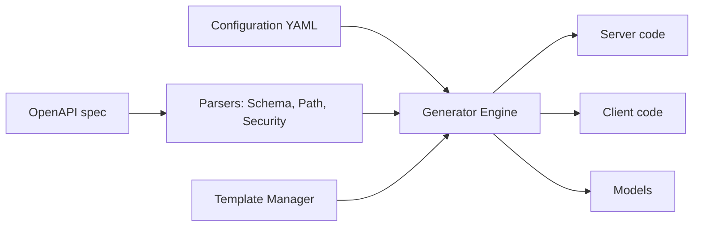

# oapi-codegen/oapi-codegen

> Outil et bibliothèque qui convertissent des spécifications OpenAPI 3.0/3.1 en code Go : serveur, client ou modèles.

## Le problème
Écrire à la main le code répétitif d'un serveur ou d'un client HTTP à partir d'un contrat OpenAPI.

## Ce que ça fait vraiment
Un fichier de configuration YAML pilote la génération de modèles, de serveurs (Chi, Echo, Fiber, Gin, gorilla/mux, Iris, `net/http`), de clients et d'un « strict server » qui simplifie les signatures. Il gère `allOf/anyOf/oneOf`, les références externes (import mapping), les overlays OpenAPI, les types nullables et les extensions `x-go-*`. Les modèles de code sont des `text/template` surchargeables. La validation de requête passe par des middlewares séparés.

## Comment c'est branché


## Essayer
```bash
go get -tool github.com/oapi-codegen/oapi-codegen/v2/cmd/oapi-codegen@latest
go install github.com/oapi-codegen/oapi-codegen/v2/cmd/oapi-codegen@latest
oapi-codegen -version
```
Puis, dans le code : `//go:generate go tool oapi-codegen -config cfg.yaml ../../api.yaml`.

## Coût et pièges
Gratuit. Go 1.25+ pour compiler l'outil. Le chemin d'import a changé (`deepmap` vers `oapi-codegen`, dès v2.3.0). Les surcharges de templates et le contenu de `pkg/` sont instables.

## Ce que ce n'est pas
Ce n'est pas compatible OpenAPI 2.0 (Swagger) sans conversion préalable. La validation des réponses par middleware n'est pas possible. Il ne génère que du Go.

## Alternatives
Aucune alternative nommée dans le README.

## Pour toi
Ignorer : il ne produit que du code Go ; utile seulement à une équipe MLOps qui écrit ses services d'API en Go.

