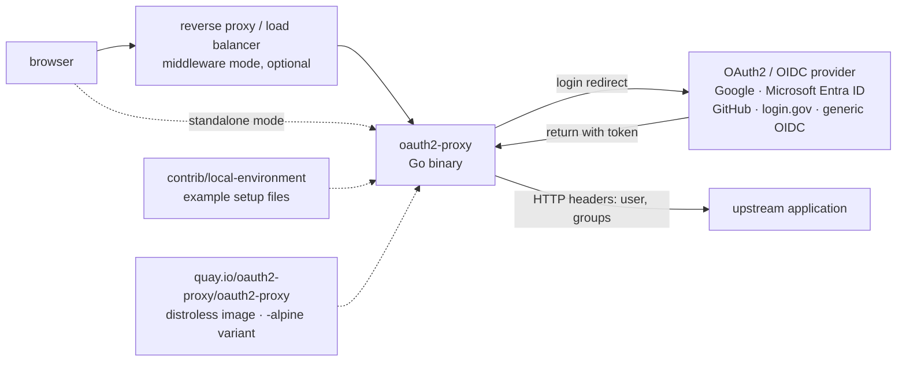

# oauth2-proxy/oauth2-proxy

> **A gatekeeper that puts a web application behind OAuth2 / OIDC authentication without changing it.**

## The problem

An internal application — a dashboard, an experiment-tracking UI, an exposed notebook — often has
no authentication at all, or a homegrown one nobody wants to maintain. Wiring OAuth2 / OIDC into
every application, for every identity provider, means rewriting the same dance of redirects,
tokens and sessions over and over.

## What it actually does

OAuth2 Proxy sits *in front of* the application: it intercepts requests, sends unauthenticated
users to an OAuth2 provider, and only lets through those who come back with a valid identity.
The README describes two ways to run it: as a standalone reverse proxy, or as a middleware
component plugged into a reverse proxy or load balancer you already operate — in that second
mode, one instance can cover several applications.

On the provider side it accepts a generic OIDC client, plus the specific implementations named
in the README: Google, Microsoft Entra ID, GitHub, login.gov and others. The point of a specific
implementation is that it extracts more about the user — the README cites preferred usernames
and groups.

That information is then forwarded to the upstream application as HTTP headers. That is the whole
contract: the application never sees OAuth2, it sees headers. The project itself does neither
identity management nor fine-grained authorization; it is the door.

## How it is wired



No code-derived diagram exists for this repository: this graph is rebuilt from the README alone,
which itself points at an image `docs/static/img/simplified-architecture.svg` not read here.

## Trying it

```bash
# The README gives no install command and no run command at all.
# It points to three external resources, with no command line quoted:
#   - the installation docs: oauth2-proxy.github.io/oauth2-proxy/installation
#   - the repository example files: contrib/local-environment
#   - the compiled binaries of the latest release (GitHub Releases)
# The only concrete identifiers in the README are the container images:
#   quay.io/oauth2-proxy/oauth2-proxy           (stable, distroless base since v7.6.0)
#   quay.io/oauth2-proxy/oauth2-proxy-nightly   (built from master, unstable)
```

Nothing is reconstructed here: the README documents no invocation.

## Cost and gotchas

- **Free, MIT licence** as stated in the README and its badge. No paid edition, no quota, no
  account to create on the project side.
- **The real prerequisite is an identity provider**: you need an OAuth2 application registered
  with Google, Microsoft Entra ID, GitHub, login.gov or some OIDC, with its client credentials
  and callback URL. If that provider is a hosted third party, your application's availability
  inherits from its own — hence the alert.
- **Nightly images**: `quay.io/oauth2-proxy/oauth2-proxy-nightly` is built from `master` and the
  README calls it unstable, explicitly **not** for production.
- **Versions v6.0.0 and older**: the README flags an open redirect vulnerability
  (GHSA-5m6c-jp6f-2vcv) and strongly recommends upgrading. An old install is a hole.
- **Merge pace**: the project describes itself as volunteer-driven and warns that review times
  vary. Do not plan around a fast upstream fix for your own need.
- **Distroless base since v7.6.0**: fewer dependencies, but no shell in the image — debugging
  goes through the `-alpine` suffixed variants.

## What it is not

- **It is not an identity provider.** It stores no users, handles no passwords, issues no tokens:
  it consumes them. Without Google, Entra ID, GitHub or some OIDC behind it, there is nothing to
  protect anything with.
- **It is not a fine-grained authorization engine.** The README stops at forwarding HTTP headers
  (user, groups) upstream; deciding who may do what remains the application's job.
- **It is not necessarily a full reverse proxy**: the middleware mode assumes you already run one.
  The standalone mode exists, but the README details neither its routing features, nor TLS
  termination, nor scaling.

## Alternatives

| | When to prefer it |
|---|---|
| **goauthentik/authentik** | Prefer it when the identity provider is missing too: authentik covers user management on top of the gate, where oauth2-proxy assumes an existing provider. Pick oauth2-proxy when identity already lives in Google, Entra ID or GitHub and you only want to add a door. |
| **drakkan/sftpgo** | Not comparable: a file transfer server, not an HTTP gatekeeper. |
| **mitmproxy/mitmproxy** | Not comparable despite the word "proxy": a traffic interception and inspection tool for debugging, not production access control. |

`anchore/grype`, the last suggested neighbour, is a vulnerability scanner: off topic here.

## For you

Adopt it as soon as a data or AI application has to leave the local machine: MLflow, a Streamlit
dashboard, a tracking UI, an internal inference service — all of them expose themselves with no
authentication by default, and this repository is the shortest way to put a door in front of them
without touching their code. The entry cost is registering an OAuth2 application with your own
provider, not the component itself. Skip it only if your API gateway or service mesh already does
this job.
