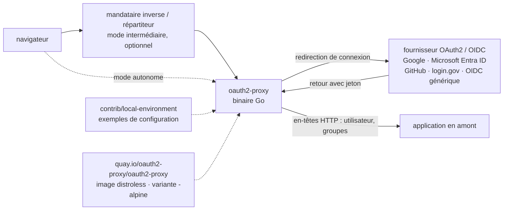

# oauth2-proxy/oauth2-proxy

> **Un portier qui met une application web derrière une authentification OAuth2 / OIDC sans la modifier.**

## Le problème

Une application interne — tableau de bord, interface de suivi d'expériences, notebook exposé —
n'a souvent aucune authentification, ou une authentification maison qu'on ne veut pas maintenir.
Câbler OAuth2 / OIDC dans chaque application, pour chaque fournisseur d'identité, revient à
réécrire dix fois la même danse de redirections, de jetons et de sessions.

## Ce que ça fait vraiment

OAuth2 Proxy se place *devant* l'application : il intercepte les requêtes, renvoie l'utilisateur
non authentifié vers un fournisseur OAuth2, et ne laisse passer que ceux qui reviennent avec une
identité valide. Le README décrit deux modes d'emploi : mandataire inverse autonome, ou composant
intermédiaire branché dans un mandataire inverse ou un répartiteur de charge déjà en place —
dans ce second cas, une seule instance peut couvrir plusieurs applications.

Côté fournisseurs, il accepte un client OIDC générique, plus des implémentations spécifiques
nommées dans le README : Google, Microsoft Entra ID, GitHub, login.gov et d'autres. L'intérêt
d'une implémentation spécifique est qu'elle extrait davantage d'informations sur l'utilisateur —
le README cite le nom d'utilisateur préféré et les groupes.

Ces informations sont ensuite transmises à l'application en amont sous forme d'en-têtes HTTP.
C'est tout le contrat : l'application ne voit pas OAuth2, elle voit des en-têtes. Le projet lui-même
ne fait ni la gestion d'identité, ni l'autorisation fine ; il fait la porte.

## Comment c'est branché



Aucun diagramme tiré du code n'existe pour ce dépôt : ce schéma est reconstruit depuis le seul
README, qui renvoie par ailleurs à une image `docs/static/img/simplified-architecture.svg` non lue ici.

## Essayer

```bash
# Aucune commande d'installation ni de lancement n'est donnée dans le README.
# Il renvoie vers trois ressources externes, sans ligne de commande citée :
#   - la documentation d'installation : oauth2-proxy.github.io/oauth2-proxy/installation
#   - les fichiers d'exemple du dépôt : contrib/local-environment
#   - les binaires compilés de la dernière version (GitHub Releases)
# Les seuls identifiants concrets du README sont les images de conteneur :
#   quay.io/oauth2-proxy/oauth2-proxy           (stable, base distroless depuis v7.6.0)
#   quay.io/oauth2-proxy/oauth2-proxy-nightly   (construite sur master, instable)
```

Rien n'est reconstruit ici : le README ne documente aucune invocation.

## Coût et pièges

- **Gratuit, licence MIT** annoncée dans le README et dans le badge. Aucune édition payante,
  aucun quota, aucun compte à créer côté projet.
- **Le prérequis réel est un fournisseur d'identité** : il faut une application OAuth2 déclarée
  chez Google, Microsoft Entra ID, GitHub, login.gov ou un OIDC quelconque, avec ses identifiants
  client et son URL de rappel. Si ce fournisseur est un service tiers hébergé, la disponibilité
  de votre application dépend de la sienne — c'est le sens de l'alerte.
- **Images nightly** : `quay.io/oauth2-proxy/oauth2-proxy-nightly` est construite depuis `master`
  et le README la déclare instable, à ne **pas** mettre en production.
- **Versions ≤ v6.0.0** : le README signale une vulnérabilité de redirection ouverte
  (GHSA-5m6c-jp6f-2vcv) et recommande fortement la mise à jour. Une installation ancienne est un trou.
- **Rythme de fusion** : le projet se déclare porté par des volontaires et prévient que les délais
  de relecture varient. Ne pas compter sur un correctif amont rapide pour un besoin propre.
- **Base distroless depuis v7.6.0** : moins de dépendances, mais pas de shell dans l'image — le
  déverminage passe par les variantes suffixées `-alpine`.

## Ce que ce n'est pas

- **Ce n'est pas un fournisseur d'identité.** Il ne stocke pas d'utilisateurs, ne gère pas de mots
  de passe, n'émet pas de jetons : il en consomme. Sans Google, Entra ID, GitHub ou un OIDC en face,
  il n'y a rien à protéger avec.
- **Ce n'est pas un moteur d'autorisation fine.** Le README s'arrête au transfert d'en-têtes HTTP
  (utilisateur, groupes) vers l'amont ; décider qui a droit à quoi reste le travail de l'application.
- **Ce n'est pas nécessairement un mandataire inverse complet** : le mode intermédiaire suppose que
  vous en exploitiez déjà un. Le mode autonome existe, mais le README ne détaille ni ses capacités
  de routage, ni sa terminaison TLS, ni sa mise à l'échelle.

## Alternatives

| | Quand le préférer |
|---|---|
| **goauthentik/authentik** | À préférer quand il manque aussi le fournisseur d'identité : authentik couvre la gestion des utilisateurs en plus du portier, là où oauth2-proxy suppose un fournisseur existant. Choisir oauth2-proxy si l'identité est déjà chez Google, Entra ID ou GitHub et qu'on ne veut ajouter qu'une porte. |
| **drakkan/sftpgo** | Non comparable : serveur de transfert de fichiers, pas un portier HTTP. |
| **mitmproxy/mitmproxy** | Non comparable malgré le mot « proxy » : outil d'interception et d'inspection de trafic pour le déverminage, pas un contrôle d'accès en production. |

`anchore/grype`, dernier voisin proposé, est un scanner de vulnérabilités : hors sujet ici.

## Pour toi

À adopter dès qu'une application data ou IA doit sortir de la machine locale : MLflow, un
tableau de bord Streamlit, une interface de suivi, un service d'inférence interne — tous
exposent par défaut sans authentification, et ce dépôt est le moyen le plus court de leur mettre
une porte sans toucher à leur code. Le coût d'entrée est la déclaration d'une application OAuth2
chez le fournisseur maison, pas le composant lui-même. À écarter seulement si votre passerelle
d'API ou votre maillage de services fait déjà ce travail.
