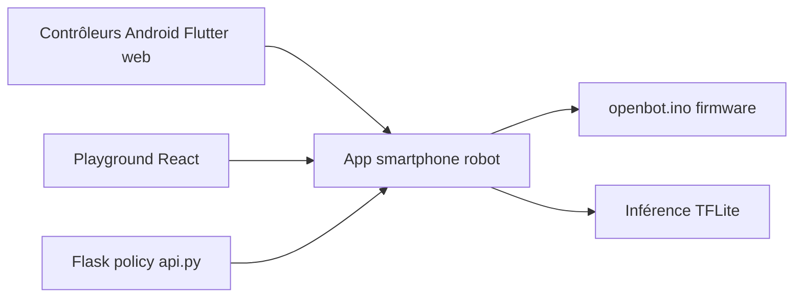

# ob-f/OpenBot

> Plateforme qui transforme un smartphone en cerveau de robot à environ 50 dollars.

## Le problème
Construire un robot mobile autonome coûte cher en capteurs et en calcul ; un smartphone les a déjà.

## Ce que ça fait vraiment
D'après l'architecture décrite : un corps de robot (CAO, cartes), un firmware Arduino (`openbot.ino`) pour moteurs et capteurs, des applications Android et iOS qui exécutent la perception (TFLite) et le contrôle, plusieurs contrôleurs (Android, Flutter, Node.js, Python, web), un « Playground » React (Blockly) pour programmer le robot, et une pile d'apprentissage de politique de conduite (scripts Python, API Flask, front React). Le README lui-même se limite à des liens vers les guides.

## Comment c'est branché


## Essayer
```bash
git clone https://github.com/ob-f/OpenBot.git
```
Les étapes de montage, de flashage et d'installation sont dans des guides liés, non reproduits dans le README.

## Coût et pièges
Le matériel n'est pas gratuit : robot d'environ 50 dollars annoncé, plus un smartphone. Le README invite à lire l'avertissement (disclaimer) avant de commencer.

## Ce que ce n'est pas
Ce n'est pas un projet logiciel seul : il mêle matériel, firmware, mobile et ML. Le détail du fonctionnement vient de l'architecture générée, pas du README.

## Alternatives
Aucune alternative n'est citée dans le README.

## Pour toi
À ignorer sauf loisir de robotique : hors du périmètre data/MLOps, même si l'entraînement de politique de conduite est un exemple d'IA embarquée.
