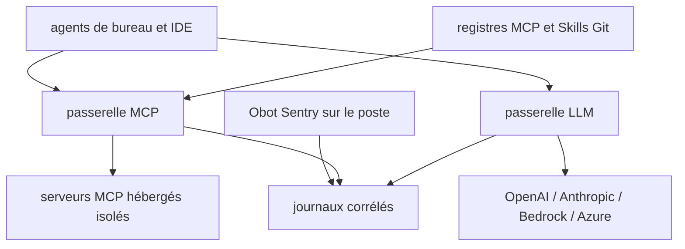

# obot-platform/obot

> Plateforme de gouvernance qui centralise accès aux modèles, serveurs MCP, skills et journaux d'activité IA.

## Le problème
Chaque poste installe ses propres serveurs MCP, ses skills et ses clés de fournisseur, sans inventaire ni contrôle.
Rien ne relie ce qui se passe sur les machines des utilisateurs à ce qui passe par les services hébergés.

## Ce que ça fait vraiment
Deux passerelles : MCP, point d'entrée unique vers les serveurs autorisés, avec serveurs composites, filtres de requêtes et gestion des OAuth et secrets ; LLM, qui présente des points d'entrée compatibles fournisseurs et garde les identifiants côté Obot.
Fait tourner serveurs MCP `npx`, `uvx` et conteneurisés en environnements isolés — conteneurs Docker ou charges Kubernetes — avec règles d'egress par domaine.
Registres MCP et Skills adossés à des catalogues Git, exposés par l'API standard de registre MCP, avec politiques d'accès par entrée, dépôt ou catalogue.
Obot Sentry, en bêta, inventorie ce qui est installé sur les postes, pose des hooks pour Claude Code, Codex, Cursor et VS Code, et enregistre les appels d'outils locaux.

## Comment c'est branché


## Essayer
```bash
docker run -d \
  --name obot \
  -p 8080:8080 \
  -v obot-data:/data \
  -v /var/run/docker.sock:/var/run/docker.sock \
  -e OBOT_SERVER_ENABLE_AUTHENTICATION=true \
  -e OBOT_BOOTSTRAP_TOKEN=<token> \
  ghcr.io/obot-platform/obot:latest
```

## Coût et pièges
Cette configuration Docker monte le socket Docker de l'hôte : le README la réserve au développement, à l'évaluation ou à un environnement mono-locataire de confiance.
Le jeton d'amorçage fait six caractères minimum, et s'il est omis Obot en génère un dans les journaux du conteneur.
Un fournisseur de modèles n'est requis que pour la passerelle LLM ; PostgreSQL externe et chiffrement relèvent du guide Kubernetes.

## Ce que ce n'est pas
Pas un client IA : Obot ne remplace ni Claude Code, ni Cursor, ni un IDE — il encadre ce qu'ils atteignent.
Pas prêt pour la production en Docker : le déploiement Kubernetes est la voie indiquée dès qu'il y a plusieurs locataires.
La gestion de parc (Sentry) est explicitement en bêta.

## Alternatives
Aucune alternative nommée dans le README.

## Pour toi
Le bon outil le jour où une équipe entière utilise des agents et qu'il faut pouvoir dire qui a appelé quoi ; beaucoup trop lourd pour un usage solo.
