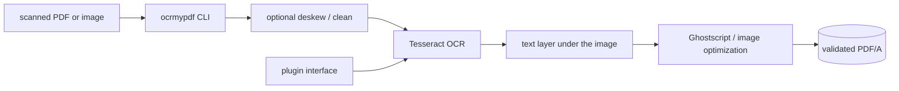

# ocrmypdf/OCRmyPDF

> **One sentence.** A command line program that adds an OCR text layer to scanned PDF files.

## The problem

A scanned PDF is a stack of images: you cannot search it or copy a line out of it. The author
writes that he looked for a free command line tool to OCR PDF files and found many, but none
satisfying — they misplaced the text under the image (breaking copy/paste), mishandled accents and
multilingual characters, changed the resolution of embedded images, produced very large files,
crashed, or emitted invalid PDFs. None of them produced PDF/A, the format dedicated to long term
storage.

## What it actually does

It generates a searchable PDF/A file from a regular PDF, placing the OCR text below the image so
copy/paste works. It keeps the exact resolution of the original embedded images and, when possible,
inserts the OCR information as a lossless operation without disrupting other content. It optimizes
PDF images, often producing files smaller than the input. On request it deskews and/or cleans the
image before OCR. It validates both input and output files, distributes work across all available
CPU cores, and accepts images as input as well. The recognition itself is delegated to the Tesseract
OCR engine and its language packs, covering more than 100 languages.

## How it is wired



No code-derived diagram exists for this repository; the graph above is reconstructed from the
README. Beyond Python itself, two external programs are required: Ghostscript and Tesseract OCR.
The project is pure Python. A plugin interface allows capabilities to be extended or replaced —
notably swapping the OCR engine, as the AppleOCR, EasyOCR and PaddleOCR plugins listed in the
README do.

## Trying it

```bash
apt install ocrmypdf        # Debian, Ubuntu, WSL
brew install ocrmypdf       # macOS Homebrew, LinuxBrew
dnf install ocrmypdf        # Fedora
```

```bash
# Add an OCR layer and require PDF/A
ocrmypdf --output-type pdfa input.pdf output.pdf

# Convert an image to single page PDF
ocrmypdf input.jpg output.pdf

# Add OCR to a file in place (only modifies file on success)
ocrmypdf myfile.pdf myfile.pdf

# OCR with non-English languages (look up your language's ISO 639-3 code)
ocrmypdf -l fra LeParisien.pdf LeParisien.pdf

# Deskew (straighten crooked pages)
ocrmypdf --deskew input.pdf output.pdf
```

```bash
ocrmypdf --help
```

## Cost and gotchas

Free, no API key, no account: the README states that it keeps private data private — everything
runs locally. The real cost is system dependencies: Ghostscript and Tesseract must be installed,
and every extra language needs its own pack (`apt-get install tesseract-ocr-chi-sim`,
`dnf install tesseract-langpack-ita`, and so on). Tesseract 4.1.1+ is required, and the version
used is whichever is found first on `PATH`, which can surprise you when several are installed.
The MPL-2.0 license permits integration with other code, including commercial and closed source,
but asks you to publish source-level modifications made to OCRmyPDF. Work is spread over all cores
by default (`--jobs`), so it is CPU hungry on large batches.

## What it is not

It is not an OCR engine: recognition is done by Tesseract, so text quality depends on Tesseract and
the language pack, not on OCRmyPDF. It is not a document structure extractor — it returns no tables,
no markdown, no structured JSON, only a PDF carrying a text layer. It is not a document management
system nor a GUI: it is a scriptable command line program (paperless-ngx is cited as the project
that integrates it into a searchable document management system). And it is not a hosted service:
Python, Ghostscript and Tesseract must be installed on the machine.

## Alternatives

- **paperless-ngx** — named in the README, but not a competitor: it *integrates* OCRmyPDF into a
  searchable document management system. Pick it when you want archiving and search on top, not
  just conversion.
- **opendatalab/MinerU**, **bytedance/Dolphin** (catalogue neighbours) — aimed at extracting
  structured content from documents, whereas OCRmyPDF aims to produce a searchable PDF/A while
  preserving the original file. Pick them when the expected output is structured text.
- **enoch3712/ExtractThinker** (catalogue neighbour) — LLM-based data extraction, a different
  problem; not comparable for simply adding an offline OCR layer.

## Why it matters to you

It is the standard front door of a document pipeline: it turns a pile of scans into searchable
PDFs, locally, with no API key and without shipping documents to a third party. For a data/AI
profile it belongs upstream of indexing or a RAG over paper archives — keeping in mind that a
structured text extractor is still needed downstream.
