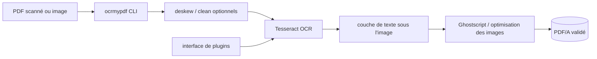

# ocrmypdf/OCRmyPDF

> **Une phrase.** Programme en ligne de commande qui ajoute une couche de texte OCR à des PDF scannés.

## Le problème

Un PDF scanné est une suite d'images : impossible d'y chercher un mot ou d'en copier une ligne.
L'auteur explique avoir cherché un outil libre en ligne de commande et n'en avoir trouvé aucun
de satisfaisant : texte mal positionné sous l'image, accents et multilingue mal gérés, résolution
des images modifiée, fichiers de sortie énormes, plantages, PDF invalides, et aucun ne produisait
de PDF/A (format prévu pour l'archivage long terme).

## Ce que ça fait vraiment

Il produit un PDF/A cherchable à partir d'un PDF ordinaire, en plaçant le texte OCR sous l'image
pour que le copier-coller fonctionne. Il conserve la résolution exacte des images embarquées et,
quand c'est possible, insère l'information OCR sans toucher au reste du contenu. Il optimise les
images du PDF — le fichier de sortie est souvent plus petit que l'entrée. Sur demande il redresse
(deskew) et nettoie l'image avant l'OCR. Il valide les fichiers d'entrée et de sortie, répartit le
travail sur tous les cœurs disponibles, et prend aussi des images en entrée. La reconnaissance
elle-même n'est pas son travail : elle est déléguée au moteur Tesseract OCR, qui couvre plus de
100 langues via ses packs linguistiques.

## Comment c'est branché



Aucun diagramme tiré du code n'existe pour ce dépôt ; ce schéma est reconstruit depuis le README.
Deux programmes externes sont requis en plus de Python : Ghostscript et Tesseract OCR. Le code
est en Python pur. Une interface de plugins permet d'étendre ou de remplacer les capacités —
notamment de remplacer le moteur OCR (voir les plugins AppleOCR, EasyOCR, PaddleOCR cités).

## Essayer

```bash
apt install ocrmypdf        # Debian, Ubuntu, WSL
brew install ocrmypdf       # macOS Homebrew, LinuxBrew
dnf install ocrmypdf        # Fedora
```

```bash
# Add an OCR layer and require PDF/A
ocrmypdf --output-type pdfa input.pdf output.pdf

# Convert an image to single page PDF
ocrmypdf input.jpg output.pdf

# Add OCR to a file in place (only modifies file on success)
ocrmypdf myfile.pdf myfile.pdf

# OCR with non-English languages (look up your language's ISO 639-3 code)
ocrmypdf -l fra LeParisien.pdf LeParisien.pdf

# Deskew (straighten crooked pages)
ocrmypdf --deskew input.pdf output.pdf
```

```bash
ocrmypdf --help
```

## Coût et pièges

Gratuit, aucune clé d'API, aucun compte : le README insiste sur le fait que les données privées
restent privées — tout tourne en local. Le coût réel est en dépendances système : Ghostscript et
Tesseract doivent être installés, et chaque langue supplémentaire demande son pack (`apt-get install
tesseract-ocr-chi-sim`, `dnf install tesseract-langpack-ita`, etc.). Tesseract 4.1.1 ou plus est
exigé, et la version utilisée est celle trouvée en premier dans le `PATH` — surprise possible si
plusieurs sont installées. La licence MPL-2.0 permet l'intégration avec du code commercial et
fermé, mais demande de publier les modifications faites à OCRmyPDF lui-même. Le travail est réparti
sur tous les cœurs par défaut (`--jobs`), donc gourmand en CPU sur de gros volumes.

## Ce que ce n'est pas

Ce n'est pas un moteur d'OCR : la reconnaissance est faite par Tesseract, la qualité du texte
dépend donc de Tesseract et du pack de langue, pas d'OCRmyPDF. Ce n'est pas un extracteur de
structure documentaire — il ne rend ni tableaux, ni markdown, ni JSON structuré : il rend un PDF
avec une couche de texte. Ce n'est pas un système de gestion documentaire ni une interface
graphique : c'est un programme scriptable en ligne de commande (paperless-ngx est cité comme le
projet qui l'intègre dans un système de recherche documentaire). Et ce n'est pas un service
hébergé : il faut installer Python, Ghostscript et Tesseract sur la machine.

## Alternatives

- **paperless-ngx** — cité dans le README, mais il n'est pas concurrent : il *intègre* OCRmyPDF
  dans un système de gestion documentaire cherchable. À choisir si on veut l'archivage et la
  recherche par-dessus, pas seulement la conversion.
- **opendatalab/MinerU**, **bytedance/Dolphin** (voisins du catalogue) — orientés extraction de
  contenu structuré depuis des documents, là où OCRmyPDF vise à produire un PDF/A cherchable en
  préservant le fichier d'origine. À choisir si la sortie attendue est du texte structuré.
- **enoch3712/ExtractThinker** (voisin du catalogue) — extraction de données par LLM, un autre
  problème ; pas comparable pour un simple ajout de couche OCR hors ligne.

## Pour toi

C'est la brique d'entrée standard d'un pipeline documentaire : elle transforme un stock de scans
en PDF cherchables, en local, sans clé d'API et sans envoyer les documents chez un tiers. Pour un
profil data/IA, c'est ce qu'on met en amont d'une indexation ou d'un RAG sur archives papier —
en gardant en tête qu'il faudra un extracteur de texte structuré derrière.
