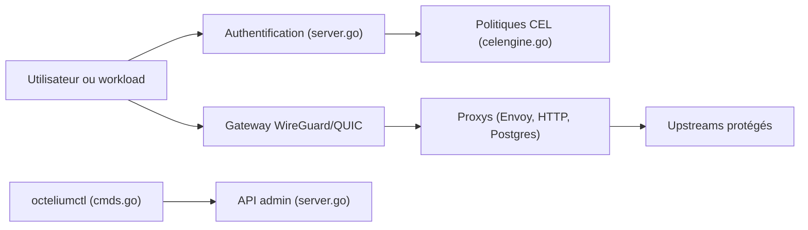

# octelium/octelium

> Plateforme d'accès zero trust auto-hébergée : VPN, ZTNA, passerelle API et IA, sur Kubernetes.

## Le problème
Donner accès à des ressources privées et à des API protégées sans distribuer de clés ni ouvrir de ports demande plusieurs outils distincts.

## Ce que ça fait vraiment
Une grappe Kubernetes exécute des proxys conscients de l'identité. Les clients se connectent en WireGuard/QUIC, ou y accèdent sans client. Contrôle d'accès par requête avec CEL et OPA, accès sans secret (clés API, SSH, bases Postgres/MySQL, mTLS), authentification OIDC/SAML avec FIDO2, TOTP et TPM, audit OpenTelemetry, déploiement de conteneurs comme services, sandboxes Cordium. Gestion déclarative via `octeliumctl`.

## Comment c'est branché


## Essayer
```bash
curl -o install-cluster.sh https://octelium.com/install-cluster.sh
chmod +x install-cluster.sh
./install-cluster.sh --domain <DOMAIN>
curl -fsSL https://octelium.com/install.sh | bash
```

## Coût et pièges
Gratuit ; VM Linux de 2 Go de RAM et 20 Go de disque minimum pour un nœud. Licence AGPL-3.0 ; des fonctions d'entreprise (tableau de bord, SIEM, SCIM) sont sous licence source-available séparée. Pas de contributions externes acceptées, un seul propriétaire derrière le projet.

## Ce que ce n'est pas
Pas un simple VPN couche 3 : c'est une architecture de proxys L7. Version 1.0 pas encore sortie, selon le README.

## Alternatives
Tailscale, Twingate, OpenVPN Access Server, Cloudflare Access, Teleport, ngrok, Kong (cités par le README).

## Pour toi
À surveiller si tu dois exposer de façon sécurisée des API de modèles ou des agents MCP ; l'effort d'exploitation d'un cluster Kubernetes est conséquent pour un usage individuel.

