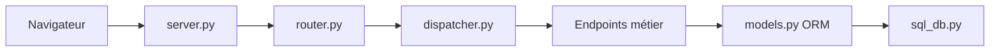

# odoo/odoo

> Suite d'applications métier web open source (CRM, comptabilité, stocks…), pour entreprises et intégrateurs.

## Le problème
Faire cohabiter CRM, facturation, entrepôt et projets dans des outils séparés qui ne se parlent pas.

## Ce que ça fait vraiment
Propose des applications installables isolément ou ensemble : CRM, site web, e-commerce, entrepôt, projets, comptabilité, point de vente, RH, marketing, fabrication. Selon le code : requête navigateur, routage HTTP, répartition, endpoints métier, puis ORM et base de données. Le README renvoie pour l'installation à la documentation.

## Comment c'est branché

## Essayer
Aucune commande documentée dans le README : installation via la documentation d'Odoo.

## Coût et pièges
Le README ne détaille pas les offres. Une base de données est nécessaire. Plus de 10 000 issues ouvertes : suivi chargé.

## Ce que ce n'est pas
Pas un outil de données ni d'IA : c'est un ERP. Le README ne dit pas ce qui reste hors de l'édition communautaire. Licence présente mais non identifiée par GitHub : à vérifier.

## Alternatives
Aucune alternative nommée dans le README.

## Pour toi
Surveiller : hors de ton périmètre data/IA, sauf si tu extrais des données d'un ERP ; vérifie la licence avant tout déploiement.

