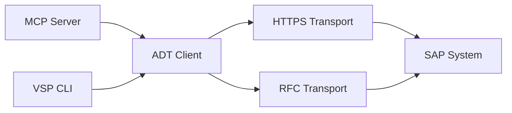

# oisee/vibing-steampunk

> Pont MCP/CLI vers SAP ADT pour qu'un assistant IA lise, écrive, débogue et déploie du code ABAP.

## Le problème
Un agent IA ne peut pas travailler sur un système SAP sans passer par Eclipse ADT et ses sessions à état.

## Ce que ça fait vraiment
Un binaire Go unique expose des outils MCP (un seul outil `SAP` en mode recommandé, 100 ou 151 en modes détaillés) et une CLI. Il parle ADT en HTTPS et le RFC classique sans SDK. Il lit et édite les sources, lance les tests et l'ATC, débogue (points d'arrêt, variables), lit dumps, logs, jobs et spools, et propose des analyses de paquets. Un serveur LSP est inclus.

## Comment c'est branché


## Essayer
```bash
curl -LO https://github.com/oisee/vibing-steampunk/releases/latest/download/vsp-linux-amd64
chmod +x vsp-linux-amd64
./vsp -s dev search "zcl_*" --type CLAS --max 50
vsp --mode hyperfocused
```

## Coût et pièges
Gratuit, mais exige un système SAP avec ADT activé (7.50+) et des identifiants. Le README avertit que modifier des variables en plein débogage change l'exécution réelle, écritures en base comprises.

## Ce que ce n'est pas
Pas un outil généraliste : uniquement pour SAP/ABAP. Certaines fonctions sont marquées recherche ou non terminées (AMDP, watchpoints).

## Alternatives
Le README cite abap-adt-api (Marcello Urbani) et mcp-abap-adt (Mario Andreschak), dont il est issu.

## Pour toi
Ignorer sauf si tu travailles sur SAP : l'outil est riche mais son domaine est ABAP, loin d'un profil data/IA/MLOps.
